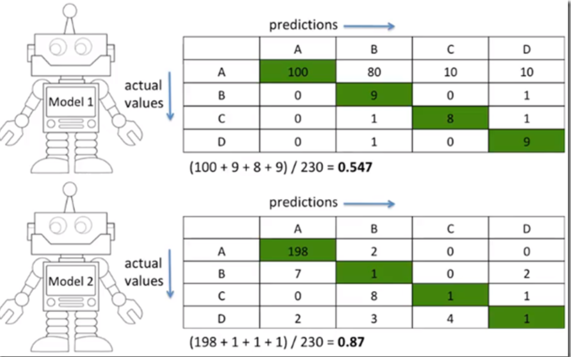
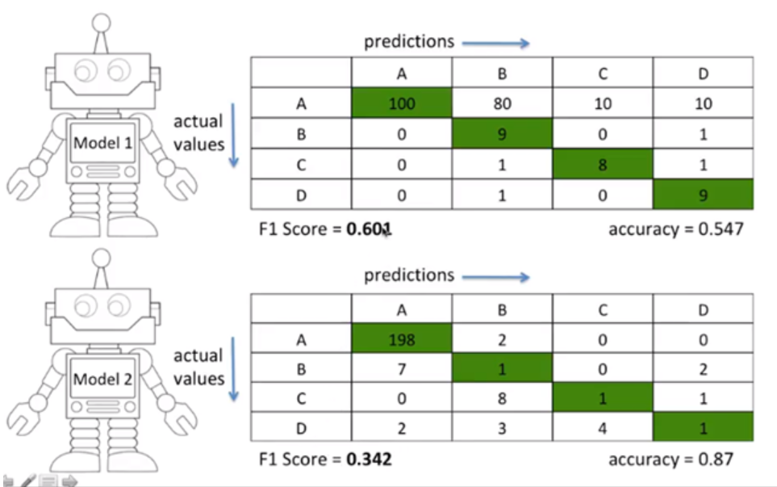

```{r setup, include=FALSE}
knitr::opts_chunk$set(echo = TRUE,
                      fig.align = "center")
```

# Preparations (준비작업) {.tabset .tabset-fade}

## Libraries

```{r load_lib, message=FALSE, warning=FALSE, results='hide'}
library(data.table)
library(tidyverse)
library(caret)
library(recipes)
library(GGally)
library(janitor)
library(lubridate)
library(ggmosaic)
library(pROC)
#devtools::install_version("ggmosaic", version = "0.2.0")
#devtools::install_version("pROC", version = "1.16.2")
#devtools::install_version("factoextra", version = "1.0.7") 
theme_set(theme_bw())
```

## Data load {.tabset .tabset-fade}

데이콘에서 진행했던 신용카드 사용자 연체 예측 ai 경진대회 데이터입니다. 원 데이터는 다중 분류 문제이지만, 먼저 이진 분류 문제로 바꿔서 진행해보겠습니다.

데이터 출처 <https://www.dacon.io/competitions/official/235713/talkboard/402821/>

```{r}
file_path <- "./data/credit_card"
files <- list.files(file_path)
files
```

```{r, message=FALSE}
dat <- fread(file.path(file_path, "train.csv"))
dat %>% select(credit) %>% table()

dat %>% 
    mutate(credit = replace(credit, credit == 0, 1), 
           credit = replace(credit, credit == 1, 0),
           credit = replace(credit, credit == 2, 1)) %>% 
    select(credit) %>% table()


dat <- dat %>% # 이진 분류 문제로 변경 
    mutate(credit = replace(credit, credit == 0, 1), 
           credit = replace(credit, credit == 1, 0),
           credit = replace(credit, credit == 2, 1))

dat$credit <- factor(dat$credit, labels = c("Good", "Bad"))

```

# Data description

-   index
-   gender: 성별
-   car: 차량 소유 여부
-   reality: 부동산 소유 여부
-   child_num: 자녀 수
-   income_total: 연간 소득
-   income_type: 소득 분류 ['Commercial associate', 'Working', 'State servant', 'Pensioner', 'Student']
-   edu_type: 교육 수준 ['Higher education' ,'Secondary / secondary special', 'Incomplete higher', 'Lower secondary', 'Academic degree']
-   family_type: 결혼 여부 ['Married', 'Civil marriage', 'Separated', 'Single / not married', 'Widow']
-   house_type: 생활 방식 ['Municipal apartment', 'House / apartment', 'With parents', 'Co-op apartment', 'Rented apartment', 'Office apartment']
-   DAYS_BIRTH: 출생일, 데이터 수집 당시 (0)부터 역으로 셈, 즉, -1은 데이터 수집일 하루 전에 태어났음을 의미
-   DAYS_EMPLOYED: 업무 시작일, 데이터 수집 당시 (0)부터 역으로 셈, 즉, -1은 데이터 수집일 하루 전부터 일을 시작함을 의미. 양수 값은 고용되지 않은 상태를 의미함
-   FLAG_MOBIL: 핸드폰 소유 여부
-   work_phone: 업무용 전화 소유 여부
-   phone: 전화 소유 여부
-   email: 이메일 소유 여부
-   occyp_type: 직업 유형
-   family_size: 가족 규모
-   begin_month: 신용카드 발급 월, 데이터 수집 당시 (0)부터 역으로 셈, 즉, -1은 데이터 수집일 한 달 전에 신용카드를 발급함을 의미

```{r}
dat %>% head()
dat <- dat %>% 
    janitor::clean_names() # 한글일 때는 주의 필요 

dat %>% glimpse()

```

# EDA(탐색적 자료분석) {.tabset .tabset-fade}

## 변수 속성 변환

```{r}
dat %>% 
    mutate_if(is.character, as.factor) %>% 
    mutate_at(vars('flag_mobil', 'work_phone', 'phone', 'email', 'occyp_type', 'credit'), .funs = as.factor) %>% 
    glimpse()

dat <- dat %>% 
    mutate_if(is.character, as.factor) %>% 
    mutate_at(vars('flag_mobil', 'work_phone', 'phone', 'email', 'occyp_type', 'credit'), .funs = as.factor)
```

## 데이터 요약통계량

-   결측치 및 이상치 확인

-   변수별 요약 통계량 확인

```{r}
dat %>% summary()
```

# visualization {.tabset .tabset-fade}

-   반응변수 vs 설명변수 상관계수 확인

-   설명변수 vs 설명변수 상관계수 확인

-   변수별 분포 확인(연속형 변수의 분포의 치우침, 범주형 변수의 class 불균형 확인)

-   범주형 설명변수와 반응변수 boxplot 그리기

-   Package : **GGally**

-   문제 : 시각화 및 EDA

## income_type : 소득 분류

```{r}
ymd_rec <- dat %>% 
    recipe(credit~.) %>% 
    step_mutate(
              days_birth = days_birth + 25152, # 출생일
              days_employed = days_employed + 15713, # 업무 시작일  
              begin_month = begin_month + 60) %>% 
    step_mutate(
              year_birth = round(days_birth/365), 
              month_birth = round(days_birth/30), 
              year_employed = round(days_employed/365),
              month_employed = round(days_employed/30), 
              begin_year = begin_month/12) %>% 
    prep() %>% 
    juice()


ymd_rec %>% 
  ggplot(aes(x = income_type)) + geom_bar() + 
  aes(stringr::str_wrap(income_type, 15)) + 
  xlab('income_type')+
  geom_label(stat = 'count', aes(label = ..count..))

ymd_rec %>% 
  ggplot(aes(x = income_type, y = income_total)) + 
  geom_boxplot(aes(fill = income_type)) 

ymd_rec %>% 
    filter(!is.na(income_type), !is.na(credit)) %>% 
    ggplot()+
    geom_mosaic(aes(x = product(income_type, credit), fill = income_type))
```

## house_type : 생활 방식

co-op apartment(주택 협동조합), house apartment, municipal apartment(공공 주택), office apartment(회사), rented apartment(임대 주택), with parents

```{r}
ymd_rec %>% 
  ggplot(aes(x = house_type)) + geom_bar() + 
  aes(stringr::str_wrap(house_type, 15)) + 
  xlab('house_type')+
  geom_label(stat = 'count', aes(label = ..count..))

ymd_rec %>% 
  ggplot(aes(x = house_type, y = income_total)) + 
  aes(stringr::str_wrap(house_type, 15)) +
  xlab('house_type')+
  geom_boxplot(aes(fill = house_type)) 
  

ymd_rec %>% 
  filter(!is.na(house_type), !is.na(credit)) %>% 
  ggplot()+geom_mosaic(aes(x = product(house_type, credit), fill = house_type))

```

## occupation type

accountants, cleaning staff, cooking staff, core staff(정규직), drivers, high skill tech staff, HR staff, IT staff, Laborers, Low-skill Laborers, managers, medicine staff

```{r}
ymd_rec %>% 
  ggplot(aes(x = occyp_type)) + geom_bar() + 
  geom_label(stat = 'count', aes(label = ..count..))+
  coord_flip()


ymd_rec %>% 
  filter(!is.na(occyp_type), !is.na(credit)) %>% 
  ggplot(aes(x = occyp_type, y = income_total, fill = occyp_type)) + 
  geom_boxplot() + 
  coord_flip()

ymd_rec %>% 
  filter(!is.na(occyp_type), !is.na(credit)) %>% 
  ggplot()+geom_mosaic(aes(x = product(occyp_type, credit), fill =occyp_type))

```

```{r}
cols <- dat %>% 
    select_if(is.factor) %>% 
    colnames()
cols
ggpairs(dat, cols[1:5])
ggpairs(dat, cols[c(6:11, 13)])

dat %>% 
    select_if(is.integer) %>% 
    ggpairs()

```

# Data preprocessing(데이터 전처리)

# Recipes

**step_cut : cut 값에 따라 연속형 변수를 이산형 변수로 변환**

-   breaks : 연속형 변수의 경계값 지정

```{r}

dat2 <- dat %>% 
    recipe(credit~.) %>%
    step_rm(flag_mobil, index) %>% 
    step_mutate(
              days_birth = days_birth + 25152, # 출생일
              days_employed = days_employed + 15713, # 업무 시작일  
              begin_month = begin_month + 60) %>% 
    step_mutate(
              month_birth = round(days_birth/30), 
              month_employed = round(days_employed/30)) %>%
    step_mutate(
              disc_employed = month_employed) %>%
  
    step_cut(disc_employed, breaks = c(407, 458, 491, 523, 12699)) %>%

    step_other(income_type, occyp_type, house_type, threshold = 0.1, other = 'infreq_combined') %>% 
    #step_impute_bag(occyp_type, impute_with = imp_vars(car, reality, income_total, income_type, edu_type, house_type, family_type, family_size),  trees = 100) %>% 
    step_normalize(all_numeric(), -all_outcomes()) %>% 
    step_rm(days_birth, days_employed, begin_month, month_employed) %>% 
    prep() %>% 
    juice()
```

# Data split(데이터 분할)

```{r}
library(rsample)
splits <- initial_split(dat2, prop = 0.7, strata = credit)
train <- training(splits)
test <- testing(splits)
```

# Modeling

# Random forest {.tabset .tabset-fade}

## Model fitting

**주의할 점**

target variable을 factor 처리할 때 label이 지정되어 있는지 확인해야함. label이 없으면 caret 패키지에서 confusion matrix 함수를 실행할 때 오류 발생.

```{r}
exdata <- data.frame(x = c(1:5), y = c(0, 1, 0, 1, 0))
exdata %>% 
  mutate(y = as.factor(y))

exdata %>% 
  mutate(y = factor(y, label = c('yes', 'no')))


```

```{r}
library(caret)

#train <- train %>% mutate(credit = factor(credit, labels = make.names(levels(credit))))

set.seed(123)
control <- trainControl(method='cv', 
                        number=5, 
                        classProbs = T, # target이 1 or 0이 아니라 yes or no 형태여야함.  
                        summaryFunction = twoClassSummary, # auc, sensitivity, specificity
                        savePredictions = T
                        )
tunegrid <- expand.grid(mtry = c(1:5))

library(tictoc)
tic()
library(doParallel)
cl <- makePSOCKcluster(4)
registerDoParallel(cl)
rf_gridsearch <- train(credit ~ .,             
                       data = train,               
                       method = 'rf',  
                       trControl = control,
                       tuneGrid = tunegrid,
                       metric = "ROC",
                       verbose = F) 
toc() # 343.98
stopCluster(cl)
rf_gridsearch

plot(varImp(rf_gridsearch, scale = F))
```


**F1-score : 위 이미지에서** $\beta$ 값에 1을 넣은 경우에 해당함(위의 값은 $F_{\beta}$ score)

**accuracy 문제점**



**F1-score**



1.  class 균형 데이터의 경우 : accuracy
2.  class 불균형 데이터의 경우 : F1-score

## confusion matrix

```{r}
pred <- predict(rf_gridsearch, newdata = test, type = "raw")

cmatrix <- caret::confusionMatrix(pred, test$credit) 
cmatrix
# positive : two class 중 어떤 class를 positive로 설정할 것인지 


cmatrix$byClass

# precision
cmatrix$byClass["Precision"]

# Recall
cmatrix$byClass["Recall"]

# F1 
cmatrix$byClass["F1"]

```

## ROC curve

```{r}
pred_prob <- predict(rf_gridsearch, newdata = test, type = "prob")
actual <- as.numeric(factor(test$credit))-1

roc_result <- roc(actual, pred_prob$Bad, levels = c(0, 1), direction = "<")
roc_result

pROC::auc(roc_result)
coords(roc_result, "best")
```

## cut off value

```{r}
par(pty="s")
plot(roc_result,
     print.thres = TRUE,
     print.auc = TRUE,
     legacy.axes = T) # TRUE : x 축 1-Spec으로 표시, FALSE : Spec으로 표시

```

# Multi-classification

```{r}
dat_m <- fread(file.path(file_path, "train.csv"))
dat_m$credit <- factor(dat_m$credit, labels = c("Good", "Notbad", "Bad"))


dat_m <- dat_m %>% 
    janitor::clean_names()

dat_m <- dat_m %>% 
    mutate_if(is.character, as.factor) %>% 
    mutate_at(vars('flag_mobil', 'work_phone', 'phone', 'email', 'occyp_type', 'credit'), .funs = as.factor)


dat_m2 <- dat_m %>% 
    recipe(credit~.) %>%
    step_rm(flag_mobil, index) %>% 
    step_mutate(
              days_birth = days_birth + 25152, # 출생일
              days_employed = days_employed + 15713, # 업무 시작일  
              begin_month = begin_month + 60) %>% 
    step_mutate(
              month_birth = round(days_birth/30), 
              month_employed = round(days_employed/30)) %>%
    step_mutate(
              disc_employed = month_employed) %>%
  
    step_cut(disc_employed, breaks = c(407, 458, 491, 523, 12699)) %>%

    step_other(income_type, occyp_type, house_type, threshold = 0.1, other = 'infreq_combined') %>% 
    #step_impute_bag(occyp_type, impute_with = imp_vars(car, reality, income_total, income_type, edu_type, house_type, family_type, family_size),  trees = 100) %>% 
    step_normalize(all_numeric(), -all_outcomes()) %>% 
    step_rm(days_birth, days_employed, begin_month, month_employed) %>% 
    prep() %>% 
    juice()

library(rsample)
splits <- initial_split(dat_m2, prop = 0.7, strata = credit)
train2 <- training(splits)
test2 <- testing(splits)


```

# Modeling

```{r}
library(caret)

set.seed(123)
control2 <- trainControl(method='cv', 
                        number=5, 
                        classProbs = T, # target이 1 or 0이 아니라 yes or no 형태여야함.  
                        summaryFunction = multiClassSummary, # auc, sensitivity, specificity
                        savePredictions = T
                        )
tunegrid <- expand.grid(mtry = c(1:5))

library(tictoc)
tic()
library(doParallel)
cl <- makePSOCKcluster(4)
registerDoParallel(cl)
rf_gridsearch2 <- train(credit ~ .,             
                       data = train2,               
                       method = 'rf',  
                       trControl = control2,
                       tuneGrid = tunegrid,
                       metric = "logLoss",
                       verbose = F) 
toc() # 343.98
stopCluster(cl)
rf_gridsearch2

plot(varImp(rf_gridsearch2, scale = F))

```

# confusion matrix

```{r}
pred_m <- predict(rf_gridsearch, newdata = test2, type = "raw")

cmatrix <- caret::confusionMatrix(pred_m, test2$credit) 
cmatrix
# positive : two class 중 어떤 class를 positive로 설정할 것인지 


cmatrix$byClass

```

## ROC curve

```{r}
pred_prob <- predict(rf_gridsearch, newdata = test2, type = "prob")
actual <- as.numeric(factor(test2$credit))-1

roc_result <- multiclass.roc(actual, pred_prob$Bad)
roc_result

pROC::auc(roc_result)
```


## cut off value

```{r}
par(pty="s")

rs <- roc_result[['rocs']]
plot.roc(rs[[1]], 
         print.thres = TRUE,
         print.auc = TRUE,
         legacy.axes = T)
sapply(2:length(rs),function(i) lines.roc(rs[[i]],col=i))

```
