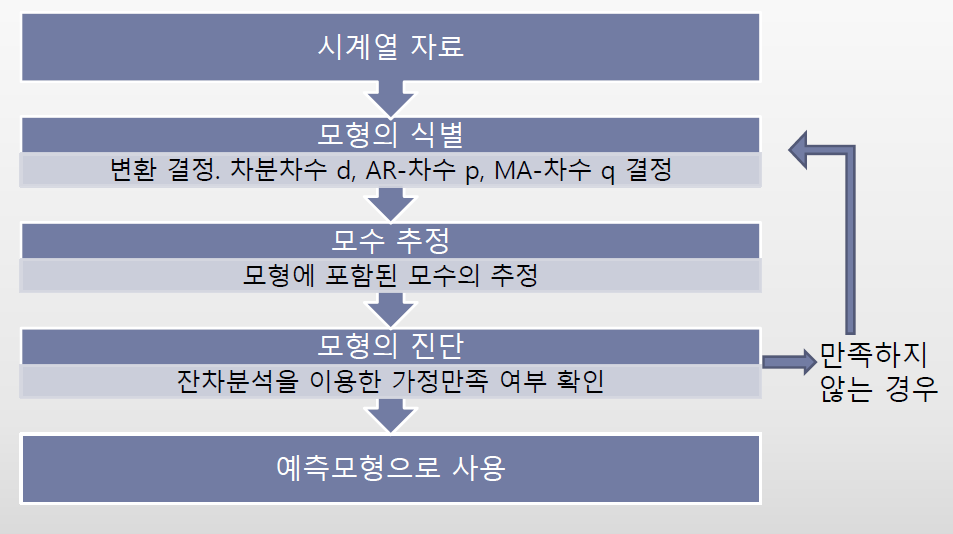

```{r setup, include=FALSE}
knitr::opts_chunk$set(echo = TRUE,
                      fig.align = "center")
```

# Preparations (준비작업)

## Libraries

```{r load_lib, message=FALSE, warning=FALSE, results='hide'}
library(data.table)
library(tidyverse)
library(forecast)
 
theme_set(theme_bw())
```

# 시계열 모형 소개 {.tabset .tabset-fade}

## 시계열 모형 종류

-   AR
-   MA
-   ARMA
-   ARIMA
-   SARIMA
-   Time series regression

**기출문제 확인 결과 ARIMA, SARIMA, Time series regression이 나옴**.

**데이터는 시계열 예제 데이터 수준이므로 분석 프로세스만 숙지하고 있으면 됨**

## 시계열 기본 가정

**백색잡음과정**

서로 독립이고 동일한 분포를 따르는(i.i.d) 확률변수로 구성된 확률과정

-   뚜렷한 추세가 없음

-   시계열의 진폭이 일정함

**이 형태 혹은 비슷한 형태를 띄어야 정상 시계열로 인식함**

**기본 가정이라고 생각하면 되고, 정상 시계열 형태가 아닐 경우 변환을 통해 정상 시계열로 만들어줘야함**


**확률보행과정**

평균은 일정하지만 분산과 자기공분산은 t 시점에 의존

-   뚜렷한 추세가 존재함

-   진폭이 불규칙적

**비정상 시계열의 대표적인 예시로 적절한 변환을 통해 정상 시계열로 만들어줘야함**


## 모형 인식 방법

**ACF(자기상관함수)**

시계열 자료 특성상 현재의 상태가 과거 및 미래의 상태와 연관되므로 시간에 따른 상관 정도를 측정하는 척도가 필요함

$$
\rho_k = \frac{cov(Z_t, Z_t+k)}{\sqrt{var(Z_k)}\sqrt{var(Z_{t+k})}}
$$

**Sample correlogram**(표본상관도표)


X축을 시차, Y축을 표본 ACF로 표현한 그림으로 모델 인식 절차에 사용됨.

-   acf() 함수로 작성 가능

-   $\rho_k = 0$이면 표본 ACF는 점근적으로 평균은 0, 분산은 $\frac{1}{n}$인 정규분포를 따르며, 이 성질에 따라 신뢰구간이 점선으로 추가됨

-   표본 ACF가 점선을 벗어나 있으면 $H_0 : \rho_k = 0$을 기각할 수 있음

-   각 시점에 대해 검정하므로 다중검정의 고질적 문제인 일종 오류가 증가하는 문제가 발생함

-   따라서 엄격한 검정 보다는 참고자료로 이용

**PACF(부분자기상관함수)**

$Z_t$와 $Z_{t+k}$ 사이의 직접적인 연관성을 측정하는 함수 $Z_t, Z_{t+1}, \cdots, Z_k$가 주어졌을 때 $Z_t$와 $Z_{t+k}$에서 $Z_{t+1}, \cdots, Z_{t+k-1}$의 효과를 제거한 후 상관관계를 측정함

**Sample partial correlogram(표본부분상관도표)**


X축을 시차, Y축을 표본 PACF로 표현한 그림으로 모델 인식 절차에 사용됨.

-   pacf() 함수로 작성 가능

-   문제점 ACF와 동일

-   따라서 엄격한 검정 보다는 참고자료로 이용

**ACF, PACF 그래프 이용해서 모형을 인식함. 따라서 그래프를 정확히 해석하는 것이 중요함**

# AR 모형 {.tabset .tabset-fade}

## AR(1)일 때

-   ACF 지수적 감소

-   PACF 1차 시점 이후 절단(1차 시점은 자기 자신이므로 상관관계는 1, 따라서 고려 X)

**이론적 그림이므로 비슷한 형태를 띄면 절단이라고 인식함. 그래프를 이용한 해석은 주관적이므로 정확한 정답은 없음. 다만 딱 봐도 절단이면 절단이라고 인식할 수 있어야 함**


## AR(2)일 때

-   ACF 지수적 감소

-   PACF 2차 시점 이후 절단

**AR(p) 차 시점 그림 또한 ACF 지수적 감소, PACF p차 시점 이후 절단으로 동일함**


# MA 모형 {.tabset .tabset-fade}

## MA(1)일 때

-   ACF 1차 시점 이후 절단

-   PACF 지수적 감소

**AR모형과 ACF, PACF 그림만 반대이고, 모형 인식 방법은 동일함**


# ARMA 모형 {.tabset .tabset-fade}

AR 모형과 MA모형을 합친 형태로, AR의 p와 MA의 q를 파라미터로 갖는 모형임

## ARMA(1, 1)일 때

-   ACF: AR(1)모형의 영향으로 지수적 감소
-   PACF: MA(1)모형의 영향으로 지수적 감소

**그림을 추가하진 않았지만 AR, MA 모형의 지수적 감소 형태와 동일함**

# AR, MA, ARMA 정리

| Model      | ACF                    | PACF                  |
|------------|------------------------|-----------------------|
| MA(q)      | q 시차 이후 0으로 절단 | 지수적으로 감소       |
| AR(p)      | 지수적으로 감소        | p시차 이후 0으로 절단 |
| ARMA(p, q) | 지수적으로 감소        | 지수적으로 감소       |

# ARIMA {.tabset .tabset-fade}

## 비정상 시계열 특징

-   추세가 존재
-   계절성 존재
-   분산이 시간대에 따라 변함

**실제 자료에서 정상성을 만족하는 경우는 거의 없으므로 변환을 통해 정상시계열로 만들어줘야함**

## 비정상 시계열 정상화 방법

**분산이 일정하지 않은 경우 : 분산안정화 변환 실시**

-   분산 증가 : 로그변환, 제곱근 변환

-   분산 감소 : 지수변환, 제곱 변환

**분산이 증가할 때**


**분산안정화 변환 실시**


**추세가 존재하는 경우 : 차분 실시**

-   추세만 보고 명확하지 않을 수 있으므로, ACF 그래프도 같이 확인 필요

-   1차 차분으로 정상성을 만족하지 않을 경우 2차 차분까지 실시

-   3차 차분은 거의 하지 않으므로 고려 X

-   계절 효과가 존재하는 경우 계절형 차분 실시

**추세가 존재하는 경우**


**1차 차분 실시**


## ARIMA(p, d, q)

ARMA 모형에 차분(d)이 추가된 모형임

-   추세가 있으면 차분 실시

-   ACF가 천천히 감소하면 차분 실시

-   차분을 통해 정상시계열로 만들어준 후 차수 결정

-   d차 차분된 자료의 ACF, PACF로 차수 결정(AR, MA, ARMA 차수 결정방법과 동일)

-   ndiffs(x, alpha = 0.05, test = c('kpss', 'adf', 'pp') ): 일반 차분 차수 추정

    -   x : 시계열 자료

    -   alpha : 유의 수준

    -   test = "kpss" : 귀무가설 - 정상시계열, 대립가설 - 비정상시계열

    -   test = "adf" : 귀무가설 - 비정상시계열, 대립가설 - 정상시계열

    -   test = "pp" : 귀무가설 - 비정상시계열, 대립가설 - 정상시계열

## Example

**데이터 생성** ARIMA(1, 1, 0)에서 난수 발생

```{r}
set.seed(123)
z <- arima.sim(model = list(order = c(1, 1, 0), ar = 0.5), n = 1000)
plot(z)
```

**1차 차분**

ARIMA(1, 1, 0)으로 식별

```{r}
ndiffs(z)
z_dif <- diff(z)
plot(z_dif)
acf(z_dif)
pacf(z_dif)
```

**과대 차분했을 경우** 정상성은 만족하지만 AR(1)모형 보다는 더 복잡한 모형으로 인식함. 모수 간결의 원칙에 따라 과대차분 모형 제외

```{r}
z_diff <- diff(z, d = 2)
plot(z_diff)
acf(z_diff)
pacf(z_diff)
```

# 모형 적합 절차 {.tabset .tabset-fade}



## 시계열 그림, SACF 작성

-   시계열 정상화 단계

-   등분산 확인 및 필요시 변환

-   최적의 차분 차수 결정

    -   ACF 형태, 단위근 검정 결과로 판단

    -   과대차분 여부 확인

## ARIMA 모형 차수 p, q 결정

-   SACF를 절단으로 인식 : MA 모형

-   SPACF를 절단으로 인식: AR 모형

-   SACF, SPACF 모두 감소로 인식 : ARMA 모형

-   ARMA 모형 중 AIC, BIC가 최소가 되는 모형 선택

## 절편 포함 여부 결정

-   arima() 함수의 경우 차분을 실시한 자료에 대한 절편 포함 여부 검정 x

-   forecast 패키지, Arima()를 이용

-   Arima(x, order = c(0, 0, 0), include.mean = T, include.drift = F, fixed = Null)

    -   x : 시계열 자료

    -   order = c(0, 0, 0) : Arima(p, d, q) 차수 결정

    -   include.mean : d = 0의 자료에 대하여 모형의 평균 포함 여부

    -   include.drift : d=1의 자료에 대하여 절편 포함 여부

    -   fixed : 비유의적 모수 제거

## 모수 추정

-   조건부 최소제곱 추정법

-   비조건부 최소제곱 추정법

-   최대가능도 추정법

**대부분의 경우 추정 결과에 차이 X, 패키지 이용할 것이므로 고려 X**

## 모형 진단

-   모형 식별과 모수 추정을 통해 얻어진 잠정 모형의 타당성 여부 판단

-   잔차분석

    -   오차항이 백색잡음과정을 따르는지 확인

-   과대적합

    -   잠정모형에 모수를 추가한 모형의 유의성을 확인하는 분석 진행

## 예측

# Arima 실습 {.tabset .tabset-fade}

## 데이터 불러오기

```{r}
#ex8_2a <- fread("data/timeseries/ex8_2a.txt")
ex_7_5d <- scan("data/timeseries/ex7_5d.txt")
ex_7_5d %>% glimpse()
```

## 시계열 그림, SACF 작성

```{r}
ex_7_5d.ts <- ts(ex_7_5d)
plot(ex_7_5d.ts)
acf(ex_7_5d.ts)
```

-   ggtsdisplay() : 추세 그래프, acf, pacf plot 생성 **ggtsdisplay() 쓰는게 효율적**

```{r}
ggtsdisplay(ex_7_5d.ts)
```

## 차분 차수 결정

-   adf test 실시

-   adf test 귀무가설은 비정상 시계열

-   귀무가설을 기각할 수 없으므로, 차분 필요

-   ndiffs 함수를 이용해서 최적 차분 차수 결정

```{r}
library(tseries)
adf.test(ex_7_5d.ts)
ndiffs(ex_7_5d.ts)
ndiffs(ex_7_5d.ts, test = "adf")
```

## 차분 결과 확인

-   원자료 확률보행과정

-   차분 이후 백색잡음과정

```{r}
ex_7_5d_diff <- diff(ex_7_5d.ts, d = 1)
ggtsdisplay(ex_7_5d_diff)
```

-   후보모형

    -   ARIMA(0, 1, 2)

    -   ARIMA(2, 1, 2) : 하위 모형 다 선택

        -   ARIMA(1, 1, 1)

        -   ARIMA(1, 1, 2)

        -   ARIMA(2, 1, 1)

```{r}
Arima(ex_7_5d_diff, order = c(0, 1, 2), include.drift = T)$aic
Arima(ex_7_5d_diff, order = c(1, 1, 1), include.drift = T)$aic
Arima(ex_7_5d_diff, order = c(1, 1, 2), include.drift = T)$aic
Arima(ex_7_5d_diff, order = c(2, 1, 1), include.drift = T)$aic
Arima(ex_7_5d_diff, order = c(2, 1, 2), include.drift = T)$aic # 후보 모형 

Arima(ex_7_5d_diff, order = c(0, 1, 2), include.drift = T)$bic # 후보 모형 
Arima(ex_7_5d_diff, order = c(1, 1, 1), include.drift = T)$bic
Arima(ex_7_5d_diff, order = c(1, 1, 2), include.drift = T)$bic
Arima(ex_7_5d_diff, order = c(2, 1, 1), include.drift = T)$bic
Arima(ex_7_5d_diff, order = c(2, 1, 2), include.drift = T)$bic

fit1 <- Arima(ex_7_5d_diff, order = c(2, 1, 2), include.drift = T)  
fit2 <- Arima(ex_7_5d_diff, order = c(0, 1, 2), include.drift = T)

```


## 절편 포함 여부  및 모수 유의성 확인

-   신뢰구간 확인 결과 두 모형 다 절편 포함
-   ARIMA(2, 1, 2)의 경우 ar1 모수 비유의 

```{r}
confint(fit1)
confint(fit2)
```
## 비유의한 모수 제거 후 다시 적합 

```{r}
fit1.1 <- Arima(ex_7_5d_diff, order = c(2, 1, 2), 
                include.drift = T, fixed = c(0, NA, NA, NA, NA))
confint(fit1.1)
```


## 모형 검진

-   두 모형 다 검정 기각 x

```{r}
checkresiduals(fit1.1)
checkresiduals(fit2)

```

## 과대 적합

```{r}
confint(Arima(ex_7_5d_diff, order = c(3, 1, 2), 
                include.drift = T, fixed = c(0, NA, NA, NA, NA, NA))) # 추가된 모수 비유의 
confint(Arima(ex_7_5d_diff, order = c(2, 1, 3), 
                include.drift = T, fixed = c(0, NA, NA, NA, NA, NA))) # 추가된 모수 비유의 

confint(Arima(ex_7_5d_diff, order = c(1, 1, 2), include.drift = T)) # 추가된 모수 비유의 
confint(Arima(ex_7_5d_diff, order = c(0, 1, 3), include.drift = T)) # 추가된 모수 유의, 절편 비유의  
```

```{r}
fit3 <- Arima(ex_7_5d_diff, order = c(0, 1, 3), include.drift = F)
checkresiduals(fit3)
```


# SARIMA {.tabset .tabset-fade}

ARIMA 모형에 계절 요소가 반영된 모형

-   ARIMA모형과 마찬가지로 차수를 정할 때 ACF, PACF 그래프를 이용해서 확인
-   계절 요소도 ACF, PACF 그래프를 이용해서 확인

## AR(1)\_12 : ARIMA(0, 0, 0)(1, 0, 0)\_12

-   ACF : 계절 주기 12의 배수에 해당하는 시차 12, 24, 36, ..에 따라 지수적으로 감소
-   PACF : 시차 12에서만 값을 갖고 그 외의 시차는 0으로 절단

## MA(1)\_12 : ARIMA(0, 0, 0)(0, 0, 1)\_12

-   ACF : 시차 12에서만 값을 갖고 그 외의 시차는 0으로 절단
-   PACF : 계절 주기 12의 배수에 해당하는 시차 12, 24, 36, ..에 따라 지수적으로 감소

## ARIMA_12: ARIMA(0, 0, 0)(1, 0, 1)\_12

-   ACF : 12 시차 이후부터 계절 주기 12 배수에 해당하는 시차에 따라 지수적 감소
-   PACF : 12 시차 이후부터 계절 주기 12 배수에 해당하는 시차에 따라 지수적 감소

## ARIMA(P, D, Q)\_s

강한 계절요소로 인해 계절 추세가 존재하는 경우

-   계절 차분을 통해 정상성 회복
-   nsdiffs(x, m = 계절 주기) : 계절 차분 차수 추정

## ARIMA(p, d, q)(P, D, Q)\_s

비계절형 ARIMA 요소, 계절형 ARIMA 요소를 모두 갖고 있는 모형

# Time series regression

내용 추가

# 시계열 그래프 그리는 방법 {.tabset .tabset-fade}

## 데이터 불러오기

-   미국 Pan Am 항공사의 1949-1960 월별 항공기 탑승객 수(천명 단위)

```{r}

AP <- AirPassengers 
AP
AP %>% glimpse()
```

## ts 객체 특성

```{r}
class(AP)
start(AP)
end(AP)
frequency(AP)
plot(AP)
```

## 월별 변동량 boxplot

```{r}
cycle(AP) # 각 자료의 해당 월을 추출 
boxplot(AP~cycle(AP))

```

## 데이터 불러오기2

-   1996.1 \~ 2006.8 미국 marine 주의 실업률

```{r}
Maine <- fread('data/timeseries/Maine.txt')
Maine

str(Maine)
class(Maine)
```

## ts 객체로 변환

**ts(data, start, end, frequency = 12)**

-   data : 시계열 자료로 변환시키고자 하는 벡터

-   start : 자료의 시작점 지정

    -   EX) 2021년 1월 : start = c(1996, 1)

-   end : 자료의 끝점 지정(생략하면 모든 데이터 포함)

    -   EX) 2021년 12월 : end = c(2005, 12)

-   freq: 주기 지정. 월별 자료는 12

```{r}
Maine.ts <- ts(Maine$unemploy, start = c(1996, 1), frequency = 12)
plot(Maine.ts)
```

## 시계열 자료 부분 선택

**window(data, start, end)**

-   data : 시계열 자료로 변환시키고자 하는 벡터

-   start : 자료의 시작점 지정

    -   EX) 2021년 1월 : start = c(1996, 1)

-   end : 자료의 끝점 지정(생략하면 모든 데이터 포함)

    -   EX) 2021년 12월 : end = c(2005, 12)

```{r}
Maine.2000 <- window(Maine.ts, start = c(2000, 1))
plot(Maine.2000)
```

## Multiple timeseries plot

```{r}
cbe <- fread('data/timeseries/cbe.txt')
cbe

```

```{r}
choc.ts <- ts(cbe$choc, start = 1958, freq = 12)
beer.ts <- ts(cbe$beer, start = 1958, freq = 12)
elec.ts <- ts(cbe$elec, start = 1958, freq = 12)

plot(cbind(choc.ts, beer.ts, elec.ts), main = "")
```

## scan

```{r}
global <- fread('data/timeseries/global.txt')
global

global_s <- scan('data/timeseries/global.txt')
global_s

global_s %>% glimpse()

plot(global_s)
```

```{r}
global.ts <- ts(global_s, start = c(1856, 1), freq = 12)
plot(global.ts, main = "")
```

## 회귀직선 추가

```{r}
new.time <- time(global.ts) # t+(i-1)/freq
plot(global.ts, main = "")
abline(lm(global.ts~new.time), col = "red")
```

# Practice

# ARIMA {.tabset .tabset-fade}

## 추세 확인

비정상 시계열, 차분 필요

```{r}
library(forecast)
female <- scan('data/timeseries/female.txt')
female.ts <- ts(female)
plot(female.ts)
ggtsdisplay(female.ts)
```

## 일반 차분

-   white noise 만족
-   p = 0, q = 0

```{r}
ndiffs(female)
female_d <- diff(female.ts)
ggtsdisplay(female_d)
```

## Model fitting

```{r}
fit <- Arima(female, order = c(0, 1, 0), include.drift = T)
checkresiduals(fit)
```

### 과대적합

```{r}
confint(Arima(female, order = c(1, 1, 0), include.drift = T)) # 추가된 모수 비유의 
confint(Arima(female, order = c(0, 1, 1), include.drift = T)) # 추가된 모수 비유의 

# ARIMA(0, 1, 0) 확정 
```

## Auto.arima

```{r}
auto.arima(female, stepwise = F)
auto.arima(female, ic = 'bic', stepwise = F)

```

## 예측

```{r}
fit <- Arima(female, order = c(0, 1, 0), include.drift = T)
plot(forecast(fit))
summary(forecast(fit))
```

# SARIMA {.tabset .tabset-fade}

## Load data

```{r}
tour <- scan('data/timeseries/tourist.txt')
tour.ts <- ts(tour, start = 1981, frequency = 12)
```

## time series plot

정상성 확인 2가지

-   등분산 확인
-   추세 확인

## 등분산 확인

-   분산 증가, 로그 변환 필요

```{r}
plot(tour.ts)
```

**분산 안정화 변환**

```{r}
lntour <- log(tour.ts)
plot(lntour)
```

## 추세 확인

일반 차분, 계절 차분 필요

```{r}
Acf(lntour, lag.max = 48)
ndiffs(lntour)
nsdiffs(lntour)
ggseasonplot(lntour)

```

## d = 1일 때 (일반 차분)

추가적으로 계절 차분 필요

```{r}
tour_1 <- diff(lntour)
ggtsdisplay(tour_1, lag.max = 48)
```

## D = 1일 때 (계절 차분)

추가적인 일반 차분이 필요해보임

```{r}
tour_12 <- diff(lntour, lag = 12)
ggtsdisplay(tour_12, lag.max = 48)
ndiffs(tour_12)
```

## d = 1, D = 1일 때

d = 1, D = 1로 결정

```{r}
tour_1_12 <- diff(tour_1, lag = 12)
ggtsdisplay(tour_1_12, lag.max = 48)
```

## Model fitting

```{r}
Acf(tour_1_12, lag.max = 48)
Pacf(tour_1_12, lag.max = 48)
```

비계절형 요소

-   ACF 절단, PACF 감소 : p = 0, q = 1
-   ACF 감소, PACF 절단 : p = 2, q = 0

계절형 확인 방법

$AR(1)_{12}$

-   ACF : 계절주기 12의 배수에 해당하는 시차에 따라 지수적으로 감소
-   PACF : 시차 12에서만 값을 갖고 그 이외의 사차에서는 0

$MA(1)_{12}$

-   ACF : 시차 12에서만 값을 갖고 그 이외의 사차에서는 0
-   PACF : 계절주기 12의 배수에 해당하는 시차에 따라 지수적으로 감소

$ARMA(1, 1)_{12}$

-   ACF : 12시차 이후부터 계절주기 12의 배수의 해당되는 시차에 따라 지수적으로 감소
-   PACF : 12시차 이후부터 계절주기 12의 배수의 해당되는 시차에 따라 지수적으로 감소

계절형 확인

-   ACF 12차 근처에서만 유의적 : P = 0, Q = 1
-   PACF 12차 근처에서만 유의적 : P = 1, Q = 0

비계절형 확인

-   ACF 절단, PACF 감소 : p = 0, q = 1

-   ACF 감소, PACF 절단 : p = 2, q = 0

최종 후보 모형

-   $ARIMA(0, 1, 1)(0, 1, 1)_{12}$

-   $ARIMA(0, 1, 1)(1, 1, 0)_{12}$

-   $ARIMA(2, 1, 0)(0, 1, 1)_{12}$

-   $ARIMA(2, 1, 0)(1, 1, 0)_{12}$

$ARIMA(0, 1, 1)(0, 1, 1)_{12}$

```{r}
fit1 <- Arima(lntour, order = c(0, 1, 1), 
              seasonal = list(order = c(0, 1, 1), period = 12))

checkresiduals(fit1)
```

## 과대 적합 확인

$ARIMA(0, 1, 1)(0, 1, 1)_{12}$

```{r}
fit1_1 <- Arima(lntour, order = c(1, 1, 1), 
              seasonal = list(order = c(0, 1, 1), period = 12))

fit1_2 <- Arima(lntour, order = c(0, 1, 2), 
              seasonal = list(order = c(0, 1, 1), period = 12))
confint(fit1)
confint(fit1_1) # 추가된 모수 유의적 
confint(fit1_2) # 추가된 모수 유의적

checkresiduals(fit1_1)
checkresiduals(fit1_2)


confint(Arima(lntour, order = c(1, 1, 2), 
              seasonal = list(order = c(0, 1, 1), period = 12))) # 추가된 모수 비유의 

confint(Arima(lntour, order = c(2, 1, 1), 
              seasonal = list(order = c(0, 1, 1), period = 12))) # 추가된 모수 비유의 

confint(Arima(lntour, order = c(0, 1, 3), 
              seasonal = list(order = c(0, 1, 1), period = 12))) # 추가된 모수 비유의 


# fit1_1, fit1_2 예측에 사용 가능 

```

$ARIMA(0, 1, 1)(1, 1, 0)_{12}$

```{r}
fit2 <- Arima(lntour, order = c(0, 1, 1), 
              seasonal = list(order = c(1, 1, 0), period = 12))

checkresiduals(fit2) # 백색잡음 오차 가정 위반 
```

## 과대적합

$ARIMA(0, 1, 1)(1, 1, 0)_{12}$

```{r}
fit2_1 <- Arima(lntour, order = c(1, 1, 1), 
              seasonal = list(order = c(1, 1, 0), period = 12))
fit2_2 <- Arima(lntour, order = c(0, 1, 2), 
              seasonal = list(order = c(1, 1, 0), period = 12))
confint(fit2_1) # 추가된 모수 유의 
confint(fit2_2) # 추가된 모수 유의

checkresiduals(fit2_1)
checkresiduals(fit2_2)

```

## 추가 과대적합

$ARIMA(1, 1, 1)(1, 1, 0)_{12}$, $ARIMA(0, 1, 2)(1, 1, 0)_{12}$

```{r}
confint(Arima(lntour, order = c(1, 1, 2), 
              seasonal = list(order = c(1, 1, 0), period = 12))) # 추가된 모수 비유의 

confint(Arima(lntour, order = c(2, 1, 1), 
              seasonal = list(order = c(1, 1, 0), period = 12))) # 추가된 모수 비유의 

confint(Arima(lntour, order = c(0, 1, 3), 
              seasonal = list(order = c(1, 1, 0), period = 12))) # 추가된 모수 비유의 

# fit2_1, fit2_2 잠정 후보 모형 
```

$ARIMA(2, 1, 0)(0, 1, 1)_{12}$

```{r}
fit3 <- Arima(lntour, order = c(2, 1, 0), 
              seasonal = list(order = c(0, 1, 1), period = 12))

checkresiduals(fit3) # 백색잡음 오차 가정 위반 
```

## 과대적합

$ARIMA(2, 1, 0)(0, 1, 1)_{12}$

```{r}
confint(Arima(lntour, order = c(2, 1, 1), 
              seasonal = list(order = c(0, 1, 1), period = 12))) # 추가된 모수 비유의 
confint(Arima(lntour, order = c(3, 1, 0), 
              seasonal = list(order = c(0, 1, 1), period = 12))) # 추가된 모수 비유의 

# fit3 잠정 후보 모형 

```

$ARIMA(2, 1, 0)(1, 1, 0)_{12}$

```{r}
fit4 <- Arima(lntour, order = c(2, 1, 0), 
              seasonal = list(order = c(1, 1, 0), period = 12))

checkresiduals(fit4) # 백색잡음 오차 가정 위반 
```

## 과대 적합

$ARIMA(2, 1, 0)(1, 1, 0)_{12}$

```{r}
confint(Arima(lntour, order = c(2, 1, 1), 
              seasonal = list(order = c(1, 1, 0), period = 12))) # 추가된 모수 비유의 

confint(Arima(lntour, order = c(3, 1, 0), 
              seasonal = list(order = c(1, 1, 0), period = 12))) # 추가된 모수 비유의 

# fit4 잠정 후보 모형 
```

## 잠정 후보 모형 AIC, BIC 비교

최종모형 : $ARIMA(2, 1, 0)(1, 1, 0)_{12}$

```{r}
c(fit1_1$aic, fit1_1$bic)
c(fit1_2$aic, fit1_2$bic)
c(fit2_1$aic, fit2_1$bic)
c(fit2_2$aic, fit2_2$bic)
c(fit3$aic, fit3$bic)
c(fit4$aic, fit4$bic)

# fit4 최종 모형으로 선택 
```

## 예측

**로그 변환된 자료에 대한 예측**

```{r}
fit4 <- Arima(lntour, order = c(2, 1, 0), 
              seasonal = list(order = c(1, 1, 0), period = 12))
plot(forecast(fit4, h = 12))
```

**원자료에 대한 예측**

```{r}
fit4_1 <- Arima(tour.ts, order = c(2, 1, 0), 
              seasonal = list(order = c(1, 1, 0), period = 12), lambda = 0)
plot(forecast(fit4_1, h = 12))

```

**실제값과 예측값 비교**

```{r}
tour92 <- scan('data/timeseries/tour92.txt')
tour92 <- ts(tour92, start = 1992, freq = 12)


fore_arima <- forecast(fit4_1, h = 12, level = 95)
plot(fore_arima)
new_t <- seq(1992, by = 1/12, length = 12)
lines(new_t, tour92, col = 'red')

accuracy(fore_arima, tour92)
```

# 회귀모형을 이용한 시계열분석

```{r}
tour <- scan('data/timeseries/tourist.txt')
tour.ts <- ts(tour, start = 1981, frequency = 12)

tour92 <- scan('data/timeseries/tour92.txt')
tour92 <- ts(tour92, start = 1992, freq = 12)

lntour <- log(tour.ts)
```

## 1차 추세계절 회귀모형

2차 추세모형 or 강한 상관관계

```{r}
Time <- time(lntour)
Month <- cycle(lntour)
fit1 <- lm(lntour~Time + factor(Month) + 0)
summary(fit1)
checkresiduals(fit1)
```

## 2차 추세모형

양의 상관관계 존재

```{r}
fit2 <- lm(lntour~Time + I(Time^2) + factor(Month) + 0)
checkresiduals(fit2)
```

### 오차모형

AR(3) 식별

```{r}
Resid <- fit2$residuals
ggtsdisplay(Resid, lag.max = 48)
```

### 오차 모형 적합

```{r}
fit_r1 <- Arima(Resid, order = c(3, 0, 0), include.mean = FALSE)
confint(fit_r1) 

checkresiduals(fit_r1)

confint(Arima(Resid, order = c(3, 0, 1), include.mean = FALSE)) # 추가된 모수 비유의 
confint(Arima(Resid, order = c(4, 0, 0), include.mean = FALSE)) # 추가된 모수 비유의 
```

## 2차 추세계절 + AR(3) 오차 회귀모형

역행렬 계산 안될 경우 1차 추세모형 대신 시도

```{r, eval=FALSE}
fit_x <- model.matrix(fit2)
f1 <- Arima(tour.ts, order = c(3, 0, 0), include.mean = FALSE, xreg = fit_x, lambda = 0)
```

## 1차 추세 계절 모형의 오차 모형

```{r}
Resid <- fit1$residuals
ggtsdisplay(Resid, lag.max = 48) # AR(3)
```

### 오차 모형 적합

$AR(3)$ 모형 확정

```{r}
fit_r2 <- Arima(Resid, order = c(3, 0, 0), include.mean = FALSE)
confint(fit_r2)

checkresiduals(fit_r2)

confint(Arima(Resid, order = c(3, 0, 1), include.mean = FALSE)) # 추가된 모수 비유의 
confint(Arima(Resid, order = c(4, 0, 0), include.mean = FALSE)) # 추가된 모수 비유의 

```

## 1차 추세계절 + AR(3) 오차 회귀모형

```{r}
fit_x <- model.matrix(fit1)
f1 <- Arima(tour.ts, order = c(3, 0, 0), include.mean = FALSE, xreg = fit_x, lambda = 0)
```

## 예측

```{r}
new.t <- time(ts(start = c(1992, 1), end = c(1992, 12), freq = 12))
new.x <- cbind(new.t, diag(rep(1, 12)))

fore_reg <- forecast(f1, xreg = new.x, level = 95)
plot(fore_reg)
```

# 예측 성능 비교

```{r}
accuracy(fore_arima, tour92)
accuracy(fore_reg, tour92)
```
