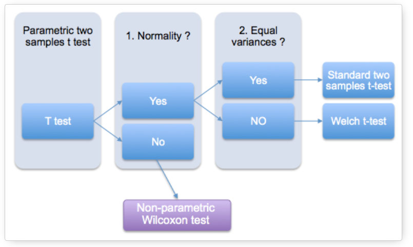

```{r setup, include=FALSE}
knitr::opts_chunk$set(echo = TRUE,
                      fig.align = "center")
```

# Preparations (준비작업)

## Libraries

```{r load_lib, message=FALSE, warning=FALSE, results='hide'}
library(data.table)
library(tidyverse)

theme_set(theme_bw())
```

# 통계 검정

## 카이제곱 검정

```{r}
df_4 <- fread("https://goo.gl/j6lRXD")  #Reading CSV
df_4 <- df_4[,-"id"]
df_4
table(df_4$treatment, df_4$improvement)
```

```{r}
chisq.test(df_4$treatment, df_4$improvement)

```

## 교호작용 

## mosaic plot 


## 일표본 t 검정

모평균(theoretical mean)과 표본평균(observed mean)을 비교하기 위한 검정 방법

**Example** 병을 채우는 기계가 병에 탄산음료 500ml의 부피로 채우도록 세팅되었다고 하자. 실제 부피는 정규 분포를 따른다. 제조업자는 이 기계가 조금 500ml 보다는 부족하게 채운다고 믿는다. 20개의 병을 샘플로 하여 내부 액체의 부피를 측정하였다.

```{r}
#df_1 <- fread("http://www.instantr.com/wp-content/uploads/2012/11/bottles.csv")
#write.csv(df_1, "data/df_1.csv")

df_1 <- fread("data/df_1.csv")

```

```{r}
boxplot(df_1$Volume)
```

```{r}
shapiro.test(df_1$Volume)
car::qqPlot(df_1$Volume)
```

```{r}
t.test(df_1$Volume, mu = 500, alternative = "less")
```

**Non-normal 일 때**

**wilcoxon test**

```{r}
wilcox.test(df_1$Volume, mu = 500, alternative = "less")

```

## 독립표본 t 검정(Unpaired t test)

두 독립 그룹 간의 평균 차이에 대한 검정 방법

**Assumption**

-   정규성
-   등분산성

**Example**

```{r}
# Data in two numeric vectors
women_weight <- c(38.9, 61.2, 73.3, 21.8, 63.4, 64.6, 48.4, 48.8, 48.5)
men_weight <- c(67.8, 60, 63.4, 76, 89.4, 73.3, 67.3, 61.3, 62.4) 
# Create a data frame
df_2 <- data.frame( 
                group = rep(c("Woman", "Man"), each = 9),
                weight = c(women_weight,  men_weight)
                )

df_2 <- df_2 %>% 
  mutate(group = as.factor(group))

df_2
```

```{r}
df_2 %>% 
  ggplot(aes(x = group, y = weight, fill = group)) + geom_boxplot()


```

**Check assumption**

```{r}
df_2_w <- df_2 %>% filter(group == "Woman") %>% select(weight)
df_2_m <- df_2 %>% filter(group == "Man") %>% select(weight)

shapiro.test(df_2_w$weight)
shapiro.test(df_2_m$weight)

```

```{r}
var.test(weight~group, data = df_2)

```

**unpaired t-test**

```{r}
t.test(df_2_w, df_2_m, var.equal = T)
t.test(df_2$weight~df_2$group, var.equal = T)
```


**Equal variance 만족 안할 때**
**welch t-test**

```{r}
t.test(df_2_w, df_2_m)
t.test(df_2$weight~df_2$group)
```


## 대응표본 t 검정

one-sample에 대해서 전후 평균 차이를 비교하는 검정 방법 

**Assumption**

-   정규성 

**Example**

열마리 쥐에 대해서 약 투약 전후 체중에 대한 데이터가 존재함 

```{r}
before <-c(200.1, 190.9, 192.7, 213, 241.4, 196.9, 172.2, 185.5, 205.2, 193.7)
# Weight of the mice after treatment
after <-c(392.9, 393.2, 345.1, 393, 434, 427.9, 422, 383.9, 392.3, 352.2)
# Create a data frame
df_3 <- data.frame( 
                group = rep(c("before", "after"), each = 10),
                weight = c(before,  after)
                )

```


```{r}
df_3 <- df_3 %>% 
  mutate(group = as.factor(group))


df_3 %>% 
  ggplot(aes(x = group, y = weight, fill = group)) +
  geom_boxplot() + 
  scale_x_discrete(limits = c("before", "after"))
```

**Check assumption**
```{r}
before <- df_3 %>% 
  filter(group == "before") %>% 
  select(weight)

after <- df_3 %>% 
  filter(group == "after") %>% 
  select(weight)

diff <- before$weight - after$weight

shapiro.test(diff)

```

**Paired t-test**
```{r}
t.test(before$weight, after$weight, paired = T)
t.test(df_3$weight~df_3$group, paired = T)
```

**Non-normal일 때**

```{r}
wilcox.test(df_3$weight~df_3$group, paired = T)

```


## t-test 정리



## 상관분석

**pearson correlation**

-   두 연속형 변수에 대한 상관관계를 분석
-   인과관계가 아닌 상관관계인 점 주의

**plot**

```{r}
plot(mtcars$mpg, mtcars$wt, xlab = "", ylab = "")
abline(lm(mtcars$wt~mtcars$mpg))

mtcars %>% 
  select(mpg, wt) %>% 
  ggplot(aes(x = wt, y = mpg)) + 
  geom_point() + 
  geom_smooth(method = "lm", se = F) # se : 신뢰구간 

```

```{r}
cor(mtcars$mpg, mtcars$wt)
```

**Hypothesis** $$
\begin{align*}
H_0: \text{두 변수 간에 상관관계가 없다.} \\
H_1: \text{두 변수 간에 상관관계가 있다.}
\end{align*}
$$

**Assumption**

-   정규성 가정(두 확률변수 각각에 대해)

**Check assumption**

-   density plot
-   normal Q-Q plot
-   shapiro-wilk normality test

```{r}

# density plot 

plot(density(mtcars$mpg))
plot(density(mtcars$wt))


# QQ plot 
qqnorm(mtcars$mpg)
qqline(mtcars$mpg)

qqnorm(mtcars$wt)
qqline(mtcars$wt)

car::qqPlot(mtcars$mpg)

# shapiro test 

shapiro.test(mtcars$wt)
shapiro.test(mtcars$mpg)


```

**correlation test**

```{r}
cor.test(iris$Petal.Width, iris$Sepal.Length, method = "pearson")
```

**non-normal일 경우**

-   spearman
-   kendal's tau

```{r}
cor.test(iris$Petal.Width, iris$Sepal.Length, method = "kendall")
cor.test(iris$Petal.Width, iris$Sepal.Length, method = "spearman")

```

## one-way ANOVA

2개 이상 그룹의 평균 차이를 검정하는 방법

**Hypothesis**

$$
\begin{align*}
&H_0: \text{그룹 간 평균 차이가 없다.} \\
&H_1: \text{최소 하나 이상 그룹 간 평균 차이가 존재한다.}
\end{align*}
$$

**Asssumption**

1.  정규성
2.  등분산성(그룹 간)

**가정이 만족하는지 반드시 체크해야함**

**Data** 정유 회사 온도(factor)에 따라 휘발유 생산량에 차이가 있는지를 알아보려고 함

```{r}
y1 <- c(50.5, 52.1, 51.9, 52.4, 50.6, 51.4, 51.2, 52.2, 51.5, 50.8)  
y2 <- c(47.5, 47.7, 46.6, 47.1, 47.2, 47.8, 45.2, 47.4, 45.0, 47.9)  
y3 <- c(46.0, 47.1, 45.6, 47.1, 47.2, 46.4, 45.9, 47.1, 44.9, 46.2) 
y <- c(y1, y2, y3)  
n <- rep(10, 3) 
group <- rep(1:3, n) 
df <- data.frame(y, group) 
df %>% head()
```

<https://rfriend.tistory.com/131>

**변수 변환**

그룹 변수를 반드시 factor로 변환해줘야 함

```{r}
df <- df %>% 
  mutate(group = as.factor(group))
```

**시각화**

```{r}
boxplot(y~group, df, xlab = "temp factor", ylab = "")

df %>% 
  ggplot(aes(x = group, y = y, fill = group)) + geom_boxplot()
```

**One-way ANOVA**

```{r}
anova_result <- aov(y~group, data = df)
summary(anova_result)
```

**Check assumption**

-   정규성 가정은 너무 정규분포와 다르지 않아도 괜찮음
-   이봉 형태이거나 너무 치우쳐져 있으면 변환 or 비모수 검정 고려

```{r}
plot(density(anova_result$residuals))
plot(anova_result, 2)
```

```{r}
plot(anova_result, 1)

```

**정규성 위반 시**

-   y에 대한 적절한 변환 진행 필요
-   log, sqrt, exp, x\^2 등이 있음
-   log 변환 시에 inf 값 주의, log(y+1)로 변환 필요
-   정규분포에 얼추 맞는 변환을 찾아야함(qqplot, density plot)

```{r, eval = F}
df2 <- df %>% 
  mutate(y = log(y))

anova_result2 <- aov(y~group, data = df2)
summary(anova_result2)
```

**비모수 검정** - 변환해도 가정 만족 안할 시 고려할 필요가 있음 - 분포 가정이 없는 검정임

```{r, eval = F}
kruskal.test(y~group, df)
```

**이상치 있을 시**

```{r}
plot(anova_result, 4)
cooksd <- cooks.distance(anova_result)

plot(cooksd)
abline(h = 4*mean(cooksd, na.rm=T), col="red")
text(x=1:length(cooksd)+1, y=cooksd, labels=ifelse(cooksd>4*mean(cooksd, na.rm=T),names(cooksd),""), col="red") 
```

```{r}
influential <- as.numeric(names(cooksd)[(cooksd > 4*mean(cooksd, na.rm=T))])

head(df[influential, ]) 

```

```{r}
car::outlierTest(anova_result)

```

## two-way ANOVA

21회 기출 참고

# text mining

## 명사 추출, 불용어 처리

## 빈도 막대 그래프


# Clustering

## k means

## pca

## fa

## gaussian mixture


## clustering 이후 classification 

