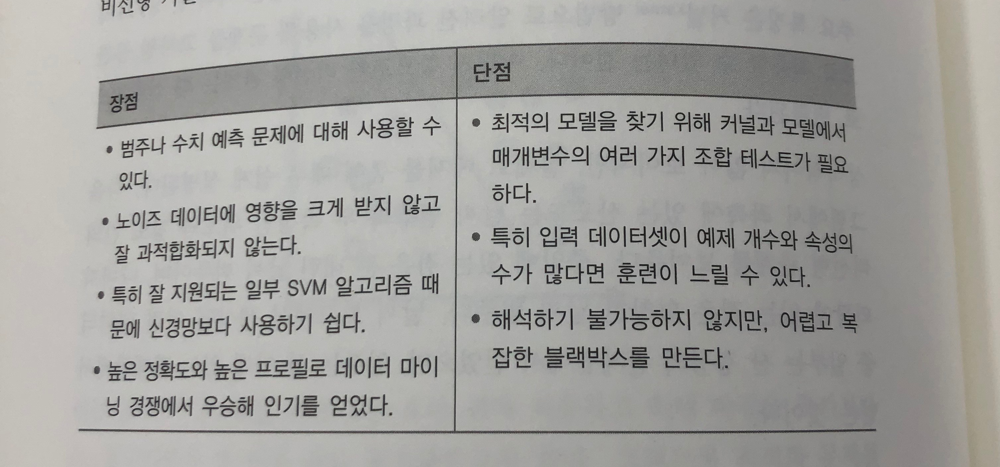
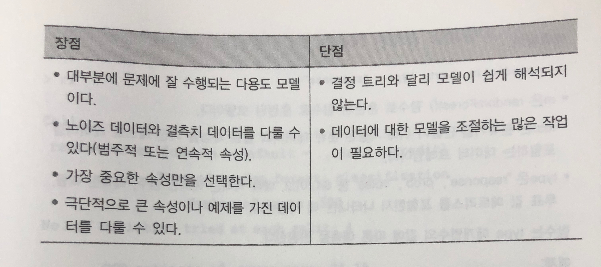
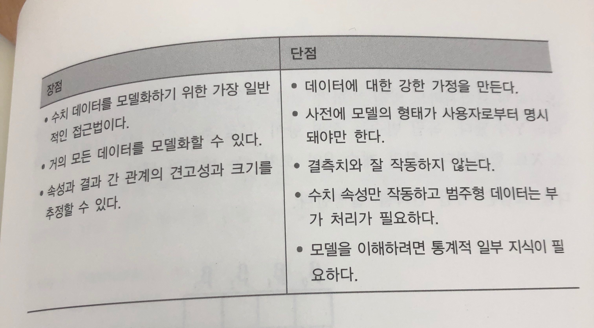
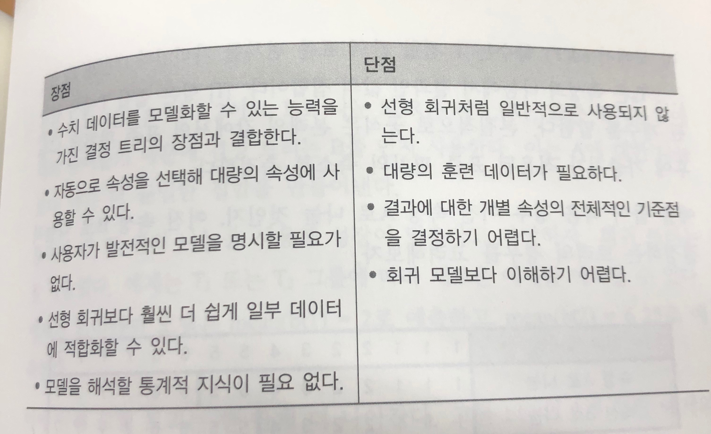
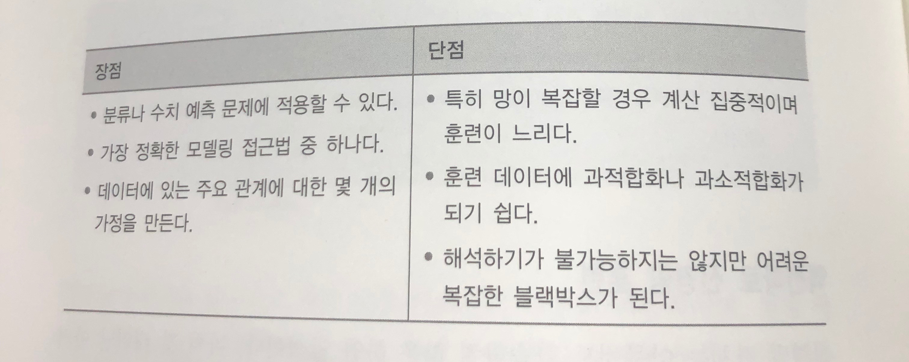

20회 복기


```{r setup, include=FALSE}
knitr::opts_chunk$set(echo = TRUE,
                      message = FALSE, 
                      warning = FALSE,
                      fig.align = "center")
```


```{r}
library(tidyverse)
library(data.table)
library(lubridate)
library(caret)
library(recipes)
library(rsample)
library(forecast)
```

# 시계열 온도 예측 문제 {.tabset .tabset-fade}

## Data description

-   year: 2016년도
-   month: 월
-   day: 일
-   week: 요일
-   temp_2: 2일 이전 최대 온도
-   temp_1: 1일 이전 최대 온도
-   average: 최대 온도 평균
-   actual: 실제 최대 온도
-   friend: 친구가 예측한 값, 평균 +- 20 사이의 임의의 숫자

```{r}
temp <- fread("data/temps.csv")
temp %>% str()
```

## 데이터 전처리 (10점)

-   데이터 확인 후 결측치 예측?   
-   예측되는 결측치를 대체
-   결측치에 대한 부분을 제외하고 다른 부분에 대한 보완이 필요하면 보완 
-   train/test set을 어떻게 나눌지 설명
-   데이터 분석 준비가 완료됨을 보여라(전처리 결과 산출)

**결측값 처리**

-   데이터 상으로 존재하지 않음
-   2016년도 1년 기준 데이터의 차원이 348, 12 이므로 시계열이 연속적이지 않음
-   따라서 시계열의 sequence가 절단되지 않도록 결측치를 채워주는 것이 바람직?

```{r}
temp %>% is.na() %>% colSums()
temp %>% dim()
```

-   2016년 day 기준 sequence를 생성하고 merge를 통해 기존 데이터를 병합해줌
-   각 변수별로 18개의 결측치가 생성됨

```{r}
temp <- temp %>% 
    mutate(date = make_date(year, month, day)) 
    

date_t <- seq(ymd("2016-01-01"), ymd("2016-12-31"), by = "1 day")

date_t %>% length()
temp %>% dim()

temp1 <- date_t %>%
    as_tibble() %>% 
    left_join(temp, by = c("value" = "date")) %>% 
    rename(date = value)

temp1 %>% is.na() %>% colSums()

```

**lag 값 비교** 

-    주어진 lag값과 actual 변수로 생성한 lag값 비교 
-    dplyr::lag 이용 
-    주어진 lag값과 실제 lag값 불일치 


```{r}
temp1 %>% head()
temp1 %>% tail()

lag1 <- temp1$temp_1

lag1_1 <- temp1$actual %>% 
  lag(n = 1) %>% 
  replace_na(45)

lag1 == lag1_1


lag2 <- temp1$temp_2
lag2_1 <- temp1$actual %>% 
  lag(n = 2) 

lag2 == lag2_1

```

**recipes**

-   recipe를 통해 결측치 처리, 필요 없는 칼럼 처리 등 데이터 전처리를 진행해줌
-   결측치 처리 방법은 본인이 편한 걸로 선택하면 됨(이전 기출 참고)
-   누락된 데이터에서 year, month, day, week 변수가 생성되었기 때문에 삭제하고 다시 생성해줌
-   year 변수의 경우 2016년도만 있기 때문에 제외

```{r}
rec <- temp1 %>% 
  recipe(actual~.) %>% 
  step_rm(forecast_acc, forecast_noaa, forecast_under, friend, year, month, day, week, temp_1, temp_2) %>% 
  step_meanimpute(average, actual) %>%
  step_mutate(month = month(date), 
              day = day(date), 
              week = week(date))
  
temp1 <- rec %>% prep() %>% juice()
temp1 %>% head()
temp1 %>% is.na() %>% colSums()


lag1_1 <- temp1$actual %>% 
  lag(n = 1) %>% 
  replace_na(45)

lag2_1 <- temp1$actual %>% 
  lag(n = 2)

lag2_1[1] <- 45
lag2_1[2] <- 44

lag_dat <- data.frame(temp1 = lag1_1, temp2 = lag2_1)

temp1 <- temp1 %>% 
  bind_cols(lag_dat)

```


**random split**
```{r}
splits <- initial_split(temp1, prop = 0.7)

train <- training(splits)
test <- testing(splits)
```

**time series split**
```{r}

splits <- initial_time_split(temp1, prop = 0.7)

train <- training(splits)
test <- testing(splits)

train %>% tail()
test %>% head()

```


## Random forest로 검증 및 분석

-   Random forest의 예측한계선을 설정하는 방법을 말하고 어떤 방법을 써야 하는지 기술
-   Random forest를 활용해 예측 및 검증, 파라미터 튜닝으로 성능 강화
-   columns 별 중요도 시각화

**caret time series fold**

-   initialWindow: the initial number of consecutive values in each training set sample

-   horizon: The number of consecutive values in test set sample

-   fixedWindow: A logical: if FALSE, the training set always start at the first sample and the training set size will vary over data splits.


```{r}
train %>% dim()
test %>% dim()
control <- trainControl(method='timeslice',
                        initialWindow = 110,
                        horizon = 110,
                        fixedWindow = FALSE
                        )

```

```{r}

rf_gridsearch <- train(actual ~ .,             
                       data = train,               
                       method = 'rf',  
                       trControl = control, 
                       metric = 'RMSE',
                       tuneLength = 30) 

plot(varImp(rf_gridsearch, scale = F))


pred <- predict(rf_gridsearch, newdata = test)
print(RMSE(pred, test$actual))

# 예측 한계선 
print(RMSE(test$average, test$actual))

```

## time series split 안했을 때

-   random split 했을 때가 모델 성능이 높음

```{r}
splits <- initial_split(temp1, prop = 0.7)

train <- training(splits)
test <- testing(splits)

set.seed(123)
control <- trainControl(method='cv', 
                        number=5)


rf_gridsearch <- train(actual ~ .,             
                       data = train,               
                       method = 'rf',  
                       trControl = control, 
                       metric = 'RMSE',
                       tuneLength = 30) 

pred <- predict(rf_gridsearch, newdata = test)
print(RMSE(pred, test$actual))

```

## SVM로 검증 및 분석

-   SVM의 예측한계선을 설정하는 방법을 말하고 어떤 방법을 써야 하는지 기술
-   SVM를 활용해 예측 및 검증, 파라미터 튜닝으로 성능 강화
-   columns 별 중요도 시각화

```{r, warning = FALSE}
set.seed(123)
control <- trainControl(method='cv', 
                        number=5)

svm_gridsearch <- train(actual ~ .,             
                       data = train,               
                       method = 'svmPoly',  
                       trControl = control, 
                       metric = 'RMSE',
                       tuneLength = 2) 
#plot(varImp(svm_gridsearch), scale = F)
svm_gridsearch
# DALEX	2.0.1
library(DALEX)
ex <- DALEX::explain(model = svm_gridsearch, 
               data = train[,-3], 
               y = train$actual)

vip <- model_parts(explainer = ex)
plot(vip)


pred <- predict(svm_gridsearch, newdata = test)
print(RMSE(pred, test$actual))

# 예측 한계선 
print(RMSE(test$average, test$actual))

```

## 최적 모델 선택

-   SVM과 RF의 장단점 서술
-   두 모델 중 어떤 모델이 좋은지 고르고 이유 설명
-   선택한 모델의 한계점 서술 및 해결할 방법 서술


**SVM**




**Random forest**




**multiple regression**




**regression tree**




**Neural network**



**참고**

**R을 활용한 기계학습, 브레트 란츠**


# 군집분석 {.tabset .tabset-fade}

-   7주 동안의 전력 소비량 데이터(15분 간격으로 측정)
-   year, month, day, 가구코드, 전력사용량

```{r}
library(ResidentialEnergyConsumption)
dat <- ResidentialEnergyConsumption::elcons_15min
dat <- dat$w44[1:50, ]
date <- seq(ymd_hm('2015-01-01 00:00'),ymd_hm('2015-01-07 23:45'), by = '15 mins')

dat <- dat %>% 
    pivot_longer(col = -VID, names_to = 'date', values_to = 'power') %>% 
    select(-date)

dat <- data.frame(date = rep(date, 50)) %>% 
    bind_cols(dat) %>% 
    mutate(year = year(date), 
           month = month(date), 
           day = day(date)) %>% 
    select(VID, date, year, month, day, power)
    
```

## clustering

-   table 만들기

| 가구코드 | Date | 일사용량 total | Cluster |
|----------|------|----------------|---------|
|          |      |                |         |
|          |      |                |         |
|          |      |                |         |

```{r}
pow <- scale(dat$power)


set.seed(123)
km.res <- kmeans(pow, 5, nstart = 25)

dat <- dat %>% 
    cbind(km.res$cluster) 

dat <- dat %>% 
  rename(cluster = `km.res$cluster`)

dat %>% head()

```


```{r}

mode <- function(x) {
  ux <- unique(x)
  ux[which.max(tabulate(match(x, ux)))]
}

result <- dat %>% 
    group_by(VID, year, month, day) %>% 
    summarise(total = sum(power, na.rm = T), clust = mode(cluster)) %>% 
    ungroup()

result %>% head()

```


## Heatmap으로 시각화하기

|     |      |      |      |      |          |
|-----|------|------|------|------|----------|
|     | 1:00 | 2:00 | 3:00 | 4:00 | 5:00 ... |
| 월  |      |      |      |      |          |
| 화  |      |      |      |      |          |
| 수  |      |      |      |      |          |
| 목  |      |      |      |      |          |
| 금  |      |      |      |      |          |
| 토  |      |      |      |      |          |
| 일  |      |      |      |      |          |


**lubridate::wday**

-    week_start = 1 : 월요일부터 시작으로 바꿔줌 
-    설정안할 경우 일요일부터 시작 

```{r}
dat %>%
    filter(cluster == 4) %>%
    mutate(wday = wday(date, label = T), 
           hour = hour(date)) %>% 
    select(wday) %>% 
    str()

dat %>%
    filter(cluster == 4) %>%
    mutate(wday = wday(date, label = T, week_start = 1), 
           hour = hour(date)) %>% 
    select(wday) %>% 
    str()
```


**scale_y_discrete**

-   limits : factor 변수에 대해 원하는 순서 지정 
-   factor로 변환하면 쉽게 순서를 바꿀 수 있음 

```{r}

dat %>%
    filter(cluster == 4) %>%
    mutate(wday = wday(date, label = T, week_start = 1), 
           hour = hour(date), 
           wday = as.factor(wday)) %>% 
    group_by(wday, hour) %>% 
    summarise(mean_w = mean(power)) %>% 
    ungroup() %>% 
    ggplot(aes(x = hour, y = wday, fill = mean_w)) + 
    geom_tile()

dat %>%
    filter(cluster == 4) %>%
    mutate(wday = wday(date, label = T, week_start = 1), 
           hour = hour(date), 
           wday = as.factor(wday)) %>% 
    group_by(wday, hour) %>% 
    summarise(mean_w = mean(power)) %>% 
    ungroup() %>% 
    ggplot(aes(x = hour, y = wday, fill = mean_w)) + 
    geom_tile() + 
    scale_y_discrete(limits = c("일", "토", "금", "목", "수", "화", "월"))


```

# 회귀 분석 모델링 {.tabset .tabset-fade}

## train/test 7:3으로 구분

## R2/RMSE/정확도 계산

-   정확도 : 실제값\>예측값인 경우 (1-예측값/실제값), 실제값\<예측값인 경우 (1-실제값/예측값) 결과를 평균내서 산출


