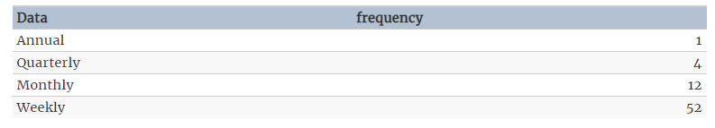

```{r setup, include=FALSE}
knitr::opts_chunk$set(echo = TRUE,
                      message = FALSE, 
                      warning = FALSE, 
                      fig.align = "center")
```

```{r}
library(tidyverse)
library(data.table)
library(lubridate)
library(caret)
library(recipes)
library(rsample)
library(forecast)
library(gt) # rmarkdown table 관련, 시험이랑 관계 x 
library(GGally)
```

18회 기출

# 고객 등급 예측 문제 {.tabset .tabset-fade}

-   시험 데이터 : ID, grade, days, count, amount
-   시험 문제와 비슷한 데이터가 없어서 다른 데이터로 대체

## Data descriptions

Zillow의 집값에 대한 데이터임. 각 행은 고유한 주택을 나타냄

-   uid: A unique identifier
-   city: 텍사스 주 오스틴 주변 마을
-   description: Zillow list에 대한 설명
-   latitude: Latitude
-   longitude: Longitude
-   garageSpaces: 차고의 수
-   hasSpa: spa 공간의 유무
-   yearBuilt: 건축년도
-   numOfPatioAndPorchFeatures: patio or 베란다의 개수
-   lotSizeSqFt: 거실 포함 부동산 부지 크기\
-   avgSchoolRating: 학교 유형에 따른 평균 학교 등급
-   MedianStudentsPerTeacher: Zillow list에 있는 모든 학교의 교사당 학생 수 중앙값
-   numOfBathrooms: 욕실의 수
-   numOfBedrooms: 침실의 수
-   priceRange: price ranges

```{r}
house <- fread("data/house.csv")
house %>% head() %>% gt()
```

## EDA

```{r}
house %>% glimpse()
house <- house %>% janitor::clean_names()
house <- house %>% 
  mutate_at(vars(city, home_type, has_spa, price_range), as.factor) %>% 
  mutate_if(is.logical, as.factor) 


```

```{r}
house %>% 
  summary()

house %>% select_if(is.numeric) %>% dim()

house %>% 
  select_if(is.numeric) %>%
  ggpairs(columns = 1:5)

house %>% 
  select_if(is.numeric) %>%
  ggpairs(columns = 6:11)


house %>% 
  select_if(is.factor) %>% 
  ggpairs()

```

## 결측치 처리

-   recipes 패키지 활용해서 처리

```{r}
house %>% is.na() %>% colSums()

```

```{r}
house_rep <- house %>% 
  recipe(price_range~.) %>% 
  #step_meanimpute()
  step_rm(uid, description) %>% 
  step_dummy(all_nominal(), -all_outcomes(), one_hot = T)
house_rec <- house_rep %>% prep() %>% juice()
```

## 파생변수 3개 생성 & 이유 작성

-   추가

## Train/test 7:3 분할

-   strata는 다른 범주 불균형인 설명변수로 해도 무방

```{r}
library(rsample)

idx <- initial_split(house_rec, prop = 0.7, strata = price_range)

train <- training(idx)
test <- testing(idx)

```

## SOM 군집분석

```{r}
library(kohonen)

train$price_range <- factor(train$price_range, label = make.names(levels(train$price_range)))
test$price_range <- factor(test$price_range, label = make.names(levels(test$price_range)))


# scaling data
trainX <- scale(train[,-which(colnames(train) ==  "price_range")])
testX <- scale(test[,-which(colnames(train) ==  "price_range")], 
               center = attr(trainX, "scaled:center"))


# make label
train.label <- train[,which(colnames(train) ==  "price_range")]
test.label <- test[,which(colnames(train) ==  "price_range")]
testXY <- list(independent = testX, dependent = test.label)


set.seed(100)
grid <- somgrid(xdim = 10, ydim = 10, topo = "hexagonal")

# make a SOM model
set.seed(100)
som_model <- xyf(as.matrix(trainX), train.label, grid, 
                  rlen = 100,
                  dist.fcts = "euclidean")


pred <- predict(som_model, newdata = as.matrix(test[, -which(colnames(test) ==  "price_range")], whatmap = 1))

pred$predictions[[1]] %>% as.data.frame() %>% names()

table(test$price_range, pred$predictions[[1]])   
```

## confusion matrix

## 분류 분석 4가지

-   rf, 다층 신경망 등 4가지 방법으로 예측 후 F1 score, ROC curve 생성

```{r}
library(caret)


train$price_range <- factor(train$price_range, label = make.names(levels(train$price_range)))
test$price_range <- factor(test$price_range, label = make.names(levels(test$price_range)))

set.seed(123)
control <- trainControl(method='cv', 
                        number=5, 
                        classProbs = T, # target이 1 or 0이 아니라 yes or no 형태여야함.  
                        summaryFunction = multiClassSummary, # auc, sensitivity, specificity
                        savePredictions = T
                        )
tunegrid <- expand.grid(mtry = c(1:5))

library(tictoc)
tic()
rf_gridsearch2 <- train(price_range ~ .,             
                       data = train,               
                       method = 'rf',  
                       trControl = control,
                       tuneGrid = tunegrid,
                       metric = "logLoss",
                       verbose = F) 
toc() 
rf_gridsearch2

plot(varImp(rf_gridsearch2, scale = F))

pred_m <- predict(rf_gridsearch2, newdata = test, type = "raw")

cmatrix <- caret::confusionMatrix(pred_m, test$price_range) 
cmatrix

```

```{r}


```

# 텍스트 마이닝(영어) {.tabset .tabset-fade}

## text 파일로 주어질 경우

```{r}
bts <- readLines("data/bts.txt")
bts %>% head()

```

**문장 토큰화**

-   텍스트 원자료를 분석할 수 있도록 토큰으로 나누는 단계

**unnest_tokens(df, output, input, to_lower = T)**

-   output : word 고정
-   input : tibble 형식의 text
-   to_lower = T : 대문자를 소문자로 변경

```{r}
tibble(text = bts) %>% 
  unnest_tokens(output = word, 
                input = text, 
                to_lower = T # 대문자를 소문자로 변경 
                ) %>% 
  head()


```

**불용어 처리**

-   불용어는 말그대로 사용하지 않는 단어로 해석에 필요가 없으므로 제거해주어야함

-   불용어를 처리하는 방법은 두가지가 있음

    -   불용어 사전에 단어 추가

    -   불용어 직접 처리

**불용어사전 이용하는 방법**

-   가장 간단한 방법은 get_stopwords()를 anti_join하면 됨
-   get_stopwords()는 불용어가 적으므로 tidytext에 내장된 stop_words 데이터를 이용하는 것이 좋음
-   stop_words는 SMART, snowball, onix 불용어집 3개를 모아놓은 데이터임

**anti_join**


```{r}
get_stopwords() %>% head()
get_stopwords() %>% dim()

tibble(text = bts) %>% 
  unnest_tokens(output = word, 
                input = text, 
                to_lower = T # 대문자를 소문자로 변경 
                ) %>% 
  anti_join(get_stopwords()) %>% 
  head()
```

```{r}
#data("stop_words")
stop_words %>% head()

tibble(text = bts) %>% 
  unnest_tokens(output = word, 
                input = text, 
                to_lower = T # 대문자를 소문자로 변경 
                ) %>% 
  anti_join(stop_words) %>% 
  head()

```

**불용어 직접 처리**

```{r}
bts_v <- bts %>% 
  str_replace_all("i’d", "i") 

tibble(text = bts_v) %>% 
    unnest_tokens(output = word, 
                input = text, 
                to_lower = T # 대문자를 소문자로 변경 
                ) %>% 
  anti_join(stop_words) %>% 
  head(n = 25)

```

**불용어 사전 수정**

-   add_rows()로 불용어 추가 가능
-   tibble로 만들고 직접 추가도 가능

```{r}
stop_words %>% add_row(word = "syou’re", # 추가할 단어    
                       lexicon = "NEW",  # 단어 사전 명칭 
                       .before = 1) # 첫 행에 추가 

stop_add <- tibble(word = c("i’d", "i’m"),
                   lexicon = "added")

stop_words2 <- bind_rows(stop_words, stop_add)
stop_words2 %>% tail()

tibble(text = bts_v) %>% 
    unnest_tokens(output = word, 
                input = text, 
                to_lower = T # 대문자를 소문자로 변경 
                ) %>% 
  anti_join(stop_words2) %>% 
  head(n = 25)

```

**빈도 그래프**

```{r}
tibble(text = bts_v) %>% 
    unnest_tokens(output = word, 
                input = text, 
                to_lower = T # 대문자를 소문자로 변경 
                ) %>% 
  anti_join(stop_words2) %>% 
  count(word, sort = TRUE) %>% 
  slice_max(n, n = 10) %>% 
  ggplot(aes(x = word, y = n)) + geom_bar(stat = "identity")

```

## 데이터 프레임에 text가 포함되어 있을 경우

```{r}
#devtools::install_version("tidytext", version = "0.2.6")
#devtools::install_version("stopwords", version = "2.1")
#devtools::install_version("tm", version = "0.7-8")
library(tidytext)

```

```{r}
train_raw <- fread("data/house.csv")
train_raw %>% head()
```

**명사 추출**

```{r}

train_raw %>%
  mutate(priceRange = parse_number(priceRange) + 100000) %>%
  unnest_tokens(word, description)
```

**불용어 처리**

```{r}
train_raw %>%
  mutate(priceRange = parse_number(priceRange) + 100000) %>%
  unnest_tokens(word, description) %>%
  anti_join(get_stopwords()) # 불용어 사전으로 조인 


```

**빈도 계산**

-   숫자가 포함되어 있음
-   제거 필요

```{r}
train_raw %>%
  mutate(priceRange = parse_number(priceRange) + 100000) %>%
  unnest_tokens(word, description) %>%
  anti_join(get_stopwords()) %>%  # 불용어 사전으로 조인 
  count(word, sort = TRUE)


```

```{r}
train_raw %>%
  mutate(priceRange = parse_number(priceRange) + 100000) %>%
  unnest_tokens(word, description) %>%
  anti_join(get_stopwords()) %>%  # 불용어 사전으로 조인 
  count(word, sort = TRUE) %>% 
  filter(!word %in% as.character(1:5))

train_raw %>%
  mutate(priceRange = parse_number(priceRange) + 100000) %>%
  unnest_tokens(word, description) %>%
  anti_join(get_stopwords()) %>%  # 불용어 사전으로 조인 
  count(word, sort = TRUE) %>% 
  filter(!word %in% as.character(1:5)) %>% 
  slice_max(n, n = 10) %>% 
  ggplot(aes(x = word, y = n)) + geom_bar(stat = "identity")

```

# 시계열분석 {.tabset .tabset-fade}

데이터 : 월별 교통사고건수

**ts()**

-   frequency 값 지정 주의




## 정상성 확인

## ARIMA 모델 3가지 제시

## 최적 모델 선택, 이유 설멍

## 최종 예측, 실제 결과와 비교, 평가방법을 선택한 이유 제시
