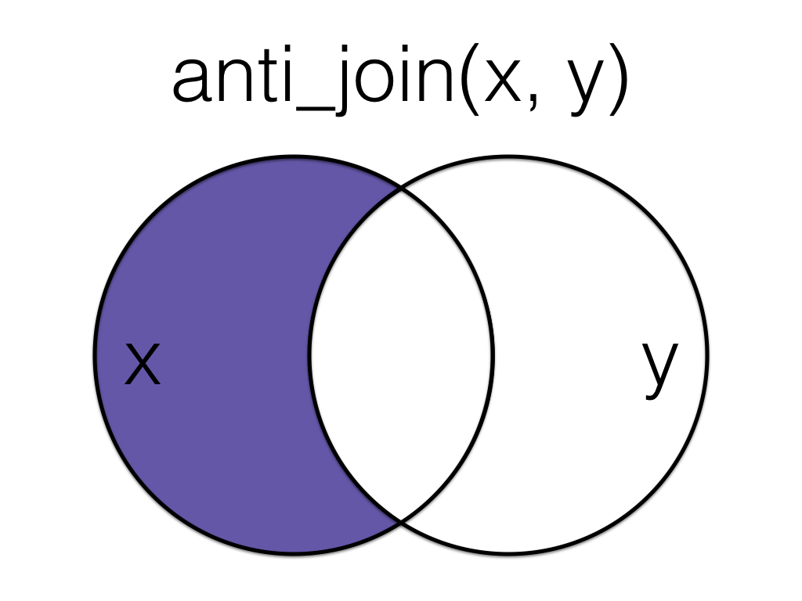

```{r setup, include=FALSE}
knitr::opts_chunk$set(echo = TRUE,
                      message = FALSE, 
                      warning = FALSE, 
                      fig.align = "center")
```

```{r}
library(tidyverse)
library(data.table)
library(lubridate)
library(caret)
library(recipes)
library(rsample)
library(forecast)
library(gt) # rmarkdown table 관련, 시험이랑 관계 x 
library(GGally)

theme_set(theme_bw())
```

18회 기출

# 고객 등급 예측 문제 {.tabset .tabset-fade}

-   시험 데이터 : ID, grade, days, count, amount
-   grade가 0, 1, 2, 3, 4인 다중 분류 문제
-   시험 문제와 비슷한 데이터가 없어서 다른 데이터로 대체

## Data descriptions

Zillow의 집값에 대한 데이터임. 각 행은 고유한 주택을 나타냄

-   uid: A unique identifier
-   city: 텍사스 주 오스틴 주변 마을
-   description: Zillow list에 대한 설명
-   latitude: Latitude
-   longitude: Longitude
-   garageSpaces: 차고의 수
-   hasSpa: spa 공간의 유무
-   yearBuilt: 건축년도
-   numOfPatioAndPorchFeatures: patio or 베란다의 개수
-   lotSizeSqFt: 거실 포함 부동산 부지 크기\
-   avgSchoolRating: 학교 유형에 따른 평균 학교 등급
-   MedianStudentsPerTeacher: Zillow list에 있는 모든 학교의 교사당 학생 수 중앙값
-   numOfBathrooms: 욕실의 수
-   numOfBedrooms: 침실의 수
-   priceRange: price ranges

```{r}
house <- fread("data/house.csv")
house %>% head() %>% gt()
```

## EDA

```{r}
house %>% glimpse()
house <- house %>% janitor::clean_names()
house <- house %>% 
  mutate_at(vars(city, home_type, has_spa, price_range), as.factor) %>% 
  mutate_if(is.logical, as.factor) 


```

```{r}
house %>% 
  summary()
```

```{r}
house %>% select_if(is.numeric) %>% dim()

house
house %>% 
  select_if(is.numeric) %>%
  ggpairs(columns = 1:5)

house %>% 
  select_if(is.numeric) %>%
  ggpairs(columns = 6:11)


house %>% 
  ggplot(aes(x = latitude, y = longitude, color = price_range)) +
  geom_point()


house %>% 
  ggplot(aes(x = latitude, y = longitude, fill = price_range)) +
  geom_hex(bins = 50)
  


house %>%
  keep(is.factor) %>%
  gather() %>%
  ggplot() +
  geom_bar(mapping = aes(x=value,fill=key), color="black") +
  facet_wrap(~ key, scales = "free") +
  theme_minimal() +
  theme(legend.position = 'none')

```

## 결측치 처리

-   실제 데이터에는 결측치가 있었음
-   recipes 패키지 활용해서 처리
-   recipes 사용법 생략
-   description(텍스트) 변수는 실제 시험 데이터에서는 나오지 않았기 때문에 생략

```{r}
house %>% is.na() %>% colSums()

```

## 파생변수 3개 생성 & 이유 작성

```{r}

house %>% 
  recipe(price_range~.) %>% 
  #step_meanimpute()
  step_rm(uid, description) %>%  
  step_other(home_type, city, threshold = 0.8) %>% 
  step_mutate(location = case_when(
    longitude >= -97.7 ~ 1, 
    latitude<=30.2 & longitude<=-97.7 ~ 2, 
    latitude>=30.2 & longitude<=-97.7 ~ 3, 
  ), 
  location = as.factor(location), 
  price_range = as.factor(price_range)) %>% 
  prep() %>% 
  juice() %>% 
  ggplot(aes(x = latitude, y = longitude, color = location)) + 
  geom_point()

```

```{r}

house_rep <- house %>% 
  recipe(price_range~.) %>% 
  #step_meanimpute()
  step_rm(uid, description) %>%  
  step_mutate(location = case_when(
    longitude >= -97.7 ~ 1, 
    latitude<=30.2 & longitude<=-97.7 ~ 2, 
    latitude>=30.2 & longitude<=-97.7 ~ 3, 
  ), 
  location = as.factor(location), 
  price_range = as.factor(price_range)) %>%
  step_other(home_type, city, threshold = 0.8) %>%
  step_dummy(all_nominal(), -all_outcomes())
house_rec <- house_rep %>% prep() %>% juice()


```

```{r}

house %>% select_if(is.factor)

som_rec <- house %>% 
  recipe(price_range~.) %>% 
  step_rm(uid, description, city, home_type, has_spa) %>% 
  step_mutate(price_range = as.factor(price_range))

som_data <- som_rec %>% prep() %>% juice()

```

## Train/test 7:3 분할

```{r}
library(rsample)

idx <- initial_split(som_data, prop = 0.7, strata = price_range)

train <- training(idx)
test <- testing(idx)

```

## SOM 군집분석

```{r}
x <- data.frame(col1 = c(1, 4, 4), 
                col2 = c(2, 3, 1), 
                col3 = c(1, 2, 3))

x <- scale(x)
x
attr(x, "scaled:center")

```

```{r}
library(kohonen)
trainX <- scale(train[, -11])
testX <- scale(test[, -11], center = attr(trainX, "scaled:center"))

som_fit <- xyf(trainX, classvec2classmat(train$price_range), 
    grid = somgrid(13, 13, "hexagonal"), rlen = 100)

som_pred <- predict(som_fit, newdata = testX, whatmap = 1)

```

## confusion matrix

```{r}
library(caret)
caret::confusionMatrix(test$price_range, som_pred$predictions[[2]])
```

## 분류 분석 4가지

-   rf, 다층 신경망 등 4가지 방법으로 예측 후 F1 score, ROC curve 생성

```{r}
library(rsample)
make.names(levels(house_rec$price_range))

house_rec$price_range <- factor(house_rec$price_range, labels = make.names(levels(house_rec$price_range)))


idx <- initial_split(house_rec, prop = 0.7, strata = price_range)

train <- training(idx)
test <- testing(idx)

```

```{r}
library(caret)

set.seed(123)
control <- trainControl(method='cv', 
                        number=5, 
                        classProbs = T, # target이 1 or 0이 아니라 yes or no 형태여야함.  
                        summaryFunction = multiClassSummary, # auc, sensitivity, specificity
                        savePredictions = T
                        )
tunegrid <- expand.grid(mtry = c(1:5))

library(tictoc)
tic()
rf_gridsearch2 <- train(price_range ~ .,             
                       data = train,               
                       method = 'rf',  
                       trControl = control,
                       tuneGrid = tunegrid,
                       metric = "logLoss") 
toc() 
rf_gridsearch2

plot(varImp(rf_gridsearch2, scale = F))

pred_m <- predict(rf_gridsearch2, newdata = test, type = "raw")

cmatrix <- caret::confusionMatrix(pred_m, test$price_range) 
cmatrix

```

```{r}


mlp_rep <- house %>% 
  recipe(price_range~.) %>% 
  #step_meanimpute()
  step_rm(uid, description) %>%  
  step_mutate(location = case_when(
    longitude >= -97.7 ~ 1, 
    latitude<=30.2 & longitude<=-97.7 ~ 2, 
    latitude>=30.2 & longitude<=-97.7 ~ 3, 
  ), 
  location = as.factor(location), 
  price_range = as.factor(price_range)) %>%
  step_other(home_type, city, threshold = 0.8) %>%
  step_dummy(all_nominal(), -all_outcomes(), one_hot = T) %>% 
  step_normalize(all_numeric_predictors())
mlp_rec <- mlp_rep %>% prep() %>% juice()


mlp_rec$price_range <- factor(mlp_rec$price_range, labels = make.names(levels(mlp_rec$price_range)))


idx <- initial_split(mlp_rec, prop = 0.7, strata = price_range)

train <- training(idx)
test <- testing(idx)

set.seed(123)
control <- trainControl(method='cv', 
                        number=5, 
                        classProbs = T, # target이 1 or 0이 아니라 yes or no 형태여야함.  
                        summaryFunction = multiClassSummary, # auc, sensitivity, specificity
                        savePredictions = T
                        )

# RSNNS	0.4-12 
# nnet	7.3-14

library(tictoc)
tic()
mlp_gridsearch2 <- train(price_range ~ .,             
                       data = train,               
                       method = 'nnet',  
                       trControl = control,
                       tuneLength = 10,
                       metric = "logLoss", 
                       verbose = F) 
toc() 
mlp_gridsearch2


pred_m <- predict(mlp_gridsearch2, newdata = test, type = "raw")

cmatrix <- caret::confusionMatrix(pred_m, test$price_range) 
cmatrix


library(tictoc)
tic()
mlp_gridsearch3 <- train(price_range ~ .,             
                       data = train,               
                       method = 'mlp',  
                       trControl = control,
                       tuneLength = 20,
                       metric = "logLoss", 
                       verbose = F) 
toc() 
mlp_gridsearch3

pred_m <- predict(mlp_gridsearch3, newdata = test, type = "raw")

cmatrix <- caret::confusionMatrix(pred_m, test$price_range) 
cmatrix


```

```{r}

library(tictoc)
tic()
xgb_gridsearch <- train(price_range ~ .,             
                       data = train,               
                       method = 'xgbTree',  
                       trControl = control,
                       tuneLength = 3,
                       metric = "logLoss") 
toc() 

pred_m <- predict(xgb_gridsearch, newdata = test, type = "raw")

cmatrix <- caret::confusionMatrix(pred_m, test$price_range) 
cmatrix
```

**F1 score**

```{r}
cmatrix$byClass

```

**ROC curve**

```{r}
library(pROC)
pred_prob <- predict(xgb_gridsearch, newdata = test, type = "prob")
actual <- as.numeric(factor(test$price_range))-1

roc_result <- multiclass.roc(actual, pred_prob$X650000.)
roc_result

pROC::auc(roc_result)


par(pty="s")

rs <- roc_result[['rocs']]
plot.roc(rs[[1]], 
         print.thres = TRUE,
         print.auc = TRUE,
         legacy.axes = T)
sapply(2:length(rs),function(i) lines.roc(rs[[i]],col=i))

```

# 텍스트 마이닝(영어) {.tabset .tabset-fade}

## text 파일로 주어질 경우

```{r}
bts <- readLines("data/bts.txt")
bts %>% head()

```

**문장 토큰화**

-   텍스트 원자료를 분석할 수 있도록 토큰으로 나누는 단계

**unnest_tokens(df, output, input, to_lower = T)**

-   output : word 고정
-   input : tibble 형식의 text
-   to_lower = T : 대문자를 소문자로 변경

```{r}
#devtools::install_version("tidytext", version = "0.2.6")
#devtools::install_version("stopwords", version = "2.1")
#devtools::install_version("tm", version = "0.7-8")
library(tidytext)

```

```{r}

library(tidytext)

tibble(text = bts) %>% 
  unnest_tokens(output = word, 
                input = text, 
                to_lower = T # 대문자를 소문자로 변경 
                ) %>% 
  head()


```

**불용어 처리**

-   불용어는 말그대로 사용하지 않는 단어로 해석에 필요가 없으므로 제거해주어야함

-   불용어를 처리하는 방법은 두가지가 있음

    -   불용어 사전에 단어 추가

    -   불용어 직접 처리

**불용어사전 이용하는 방법**

-   가장 간단한 방법은 get_stopwords()를 anti_join하면 됨
-   get_stopwords()는 불용어가 적으므로 tidytext에 내장된 stop_words 데이터를 이용하는 것이 좋음
-   stop_words는 SMART, snowball, onix 불용어집 3개를 모아놓은 데이터임

**anti_join**



```{r}
get_stopwords() %>% head()
get_stopwords() %>% dim()

tibble(text = bts) %>% 
  unnest_tokens(output = word, 
                input = text, 
                to_lower = T # 대문자를 소문자로 변경 
                ) %>% 
  anti_join(get_stopwords()) %>% 
  head()
```

```{r}
#data("stop_words")
stop_words %>% head()

tibble(text = bts) %>% 
  unnest_tokens(output = word, 
                input = text, 
                to_lower = T # 대문자를 소문자로 변경 
                ) %>% 
  anti_join(stop_words) %>% 
  head()

```

**불용어 직접 처리**

```{r}
bts_v <- bts %>% 
  str_replace_all("i’d", "i") 

tibble(text = bts_v) %>% 
    unnest_tokens(output = word, 
                input = text, 
                to_lower = T # 대문자를 소문자로 변경 
                ) %>% 
  anti_join(stop_words) %>% 
  head(n = 25)

```

**불용어 사전 수정**

-   add_rows()로 불용어 추가 가능
-   tibble로 만들고 직접 추가도 가능

```{r}
stop_words %>% add_row(word = "syou’re", # 추가할 단어    
                       lexicon = "NEW",  # 단어 사전 명칭 
                       .before = 1) # 첫 행에 추가 

stop_add <- tibble(word = c("i’d", "i’m"),
                   lexicon = "added")

stop_words2 <- bind_rows(stop_words, stop_add)
stop_words2 %>% tail()

tibble(text = bts_v) %>% 
    unnest_tokens(output = word, 
                input = text, 
                to_lower = T # 대문자를 소문자로 변경 
                ) %>% 
  anti_join(stop_words2) %>% 
  head(n = 25)

```

**빈도 그래프**

```{r}
tibble(text = bts_v) %>% 
    unnest_tokens(output = word, 
                input = text, 
                to_lower = T # 대문자를 소문자로 변경 
                ) %>% 
  anti_join(stop_words2) %>% 
  count(word, sort = TRUE) %>% 
  slice_max(n, n = 10) %>% 
  ggplot(aes(x = word, y = n)) + geom_bar(stat = "identity")

```

## 데이터 프레임에 text가 포함되어 있을 경우

```{r}
train_raw <- fread("data/house.csv")
train_raw %>% head()
```

**명사 추출**

```{r}

train_raw %>%
  mutate(priceRange = parse_number(priceRange) + 100000) %>%
  unnest_tokens(word, description)
```

**불용어 처리**

```{r}
train_raw %>%
  mutate(priceRange = parse_number(priceRange) + 100000) %>%
  unnest_tokens(word, description) %>%
  anti_join(get_stopwords()) # 불용어 사전으로 조인 


```

**빈도 계산**

-   숫자가 포함되어 있음
-   제거 필요

```{r}
train_raw %>%
  mutate(priceRange = parse_number(priceRange) + 100000) %>%
  unnest_tokens(word, description) %>%
  anti_join(get_stopwords()) %>%  # 불용어 사전으로 조인 
  count(word, sort = TRUE)


```

```{r}
train_raw %>%
  mutate(priceRange = parse_number(priceRange) + 100000) %>%
  unnest_tokens(word, description) %>%
  anti_join(get_stopwords()) %>%  # 불용어 사전으로 조인 
  count(word, sort = TRUE) %>% 
  filter(!word %in% as.character(1:5))

train_raw %>%
  mutate(priceRange = parse_number(priceRange) + 100000) %>%
  unnest_tokens(word, description) %>%
  anti_join(get_stopwords()) %>%  # 불용어 사전으로 조인 
  count(word, sort = TRUE) %>% 
  filter(!word %in% as.character(1:5)) %>% 
  slice_max(n, n = 10) %>% 
  ggplot(aes(x = word, y = n)) + geom_bar(stat = "identity")

```

# 시계열분석 {.tabset .tabset-fade}

데이터 : 월별 교통사고건수

**ts()**

-   frequency 값 지정 주의


-   나머지 생략

## 정상성 확인

## ARIMA 모델 3가지 제시

## 최적 모델 선택, 이유 설멍

## 최종 예측, 실제 결과와 비교, 평가방법을 선택한 이유 제시
